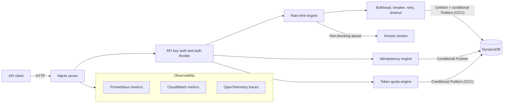
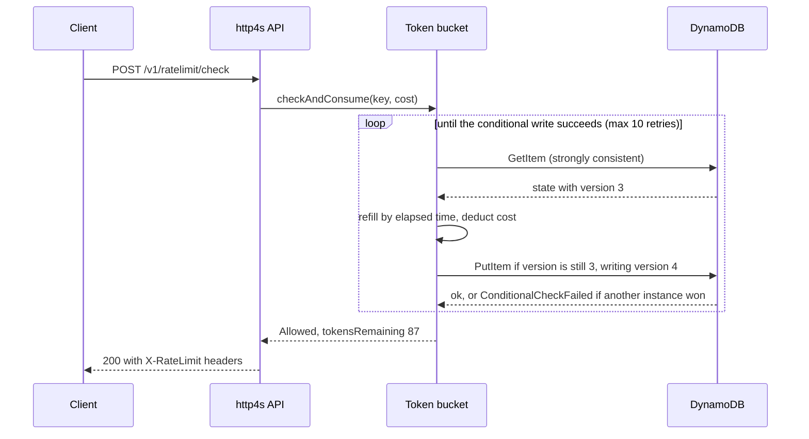

# Gate — Distributed Rate Limiting & Compliance Platform

[](https://opensource.org/licenses/MIT)
[](https://www.scala-lang.org/)
[](https://github.com/saintparish4/gate/actions/workflows/ci.yml)

A distributed rate limiter, idempotency service, and LLM token quota engine
built with Scala 3, Cats Effect, http4s, and DynamoDB. It enforces per-key
request limits and multi-level token quotas correctly across any number of
stateless instances, without a lock service.

Gate is at **0.1.0**. The three correctness properties it exists to provide are
checked in CI against a full local stack on every change, and were validated on
2026-09-14 against the Terraform-deployed stack on AWS: one Fargate task, real
DynamoDB, zero errors. See [Correctness](#correctness).

### Why Gate

- **Public or partner APIs** — per-tenant RPS and burst limits across many
  stateless containers, with one source of truth in DynamoDB
  ([token bucket + OCC](#optimistic-concurrency-control-flow)).
- **AI / LLM gateways** — stack request limits with user / agent / org token
  quotas so spend and abuse stay bounded ([token quotas](#token-quotas)).
- **Money-moving or side-effecting workflows** — idempotency keys so retries
  and double-clicks do not double-charge or double-ship ([idempotency](#idempotency)).

### What this system guarantees

| Guarantee | Mechanism |
|-----------|-----------|
| **At most X requests per key, globally** | One token-bucket item per key in DynamoDB. Every consume is a strongly consistent `GetItem` followed by a `PutItem` conditioned on the item's `version`, so only one instance wins each state change. Up to 10 conflicting writes are retried with jittered backoff; after that the request is **rejected** (429, `Retry-After: 1`). The service under-issues at the tail rather than over-issuing past the limit. |
| **Idempotent operations within a TTL** | First writer wins via a conditional `PutItem` (`attribute_not_exists(pk)`). Replays within the TTL get the stored response. A SHA-256 fingerprint of the request body turns a same-key different-body replay into `409 Conflict`. DynamoDB TTL expires the items. |
| **Multi-level token quotas** | User, agent, and org quotas are enforced together on every check. The agent quota is clamped to 80% of the user quota. Pre-request estimation, then post-response reconciliation against actual usage. |
| **Stateless instances** | All rate-limit, idempotency, and quota state lives in DynamoDB. Any instance can serve any request; a crash loses nothing. |

### What this system is designed to survive

| Failure mode | Behaviour |
|-------------|-----------|
| **DynamoDB slow or partially down** | The rate-limit store is wrapped in a bulkhead (100 concurrent calls, 500 ms max wait), a process-wide circuit breaker (20 failures to open, 30 s reset, 3 half-open calls), a retry policy (3 retries, 100 ms base, 2x backoff, 10 s cap), and a 2 s timeout per check. When the breaker is open, `DEGRADATION_MODE` decides: `reject-all` (default, safe for payments) or `allow-all` (for AI infrastructure where availability wins). Every degraded decision increments `gate_degraded_total`. |
| **Instance crash** | No in-process state. The next instance reads current DynamoDB state and continues correctly. |
| **Kinesis failure** | Events go into a bounded in-memory queue (10,000, drop-oldest) that a background fiber drains to Kinesis. A failed publish is retried once, then dropped and counted (`gate_events_dropped_total`, CloudWatch `DroppedKinesisEvent`). The request path never waits on Kinesis. |
| **OCC exhaustion on a hot key** | After 10 failed conditional writes the request is rejected with 429 instead of over-issuing. |
| **Idempotency TOCTOU race** | If the conditional create fails and the follow-up read finds nothing (TTL deleted the item in between), the check retries up to 3 times instead of returning a false `new`. |

The breaker, bulkhead, retry, and timeout wrap the rate-limit store only. The
idempotency store answers `503` if DynamoDB fails; the quota store has its own
conditional-write retry loop and answers `503` with `Retry-After: 1` under
contention.

## Architecture



### Optimistic Concurrency Control Flow

The rate limiter never locks. Each check reads the bucket, computes the new
state locally, and writes it back only if nobody else has written since.



A conflict means another instance consumed from the same bucket between the
read and the write. The loser re-reads and recomputes, so tokens are never
double-spent. Refill is driven by wall-clock time stored in the item, because
the state is shared across tasks; `core.TokenBucket` bounds what a clock
correction on one host can do (a backward step deducts nothing and never moves
`lastRefillMs` backward; a forward step mints at most `rate x step` once).

Design rationale: [ARCHITECTURE.md](docs/ARCHITECTURE.md) and the
[ADRs](docs/adr/).

## Quickstart

Prerequisites: Docker with Compose v2 (`docker compose`; the Makefile uses
`--wait`). JDK 17 and sbt only if you want to run the app outside Docker. No
AWS account needed.

```bash
make stack      # LocalStack (DynamoDB + Kinesis) and the app, both in Docker
make health     # prints /health, /ready and a sample rate-limit status
make            # lists every target
```

`make dev` starts LocalStack and runs the app with `sbt run` instead. LocalStack
is pinned to 4.14.0 and its init script creates the three tables and the
stream; both images bake in code, and the LocalStack volume survives
`make down`. If a checkout changes underneath a running stack, reset it with
`make clean && make stack`. The tell is `/health` reporting a version that
disagrees with `build.sbt`, or the correctness invariants failing with a flood
of HTTP 500s.

**1. Liveness and readiness**

```bash
curl -s http://localhost:8080/health
# {"status":"healthy","version":"0.1.0"}
curl -s http://localhost:8080/ready
# {"status":"ok","components":[{"name":"dynamodb_ratelimit","status":"ok","details":null}, ...]}
```

`/health` is liveness only and answers 200 whenever the process is up.
`/ready` pings the two DynamoDB tables and the Kinesis stream and answers 503
with `"status":"degraded"` and the failing component's error when any of them
is unreachable. The ALB target group and the deploy script wait on `/ready`.

**2. A rate-limit check**

Three API keys are built in for development: `test-api-key` (premium tier,
1,000 tokens), `free-api-key` (free tier, 20 tokens), and `admin-api-key`
(enterprise tier). They are active whenever Secrets Manager is off.

```bash
curl -s -X POST http://localhost:8080/v1/ratelimit/check \
  -H "Content-Type: application/json" \
  -H "Authorization: Bearer test-api-key" \
  -d '{"key": "user:demo", "cost": 1}' | jq .
```

```json
{
  "allowed": true,
  "tokensRemaining": 999,
  "retryAfter": null,
  "limit": 1000,
  "resetAt": "2026-09-14T10:30:05Z",
  "message": null
}
```

Allowed responses carry `X-RateLimit-Limit`, `X-RateLimit-Remaining`, and
`X-RateLimit-Reset` (epoch seconds). Every response echoes `X-Request-Id`.

**3. Exhaust a bucket**

The free tier holds 20 tokens and refills 2 per second, so 40 quick requests
drain it:

```bash
for i in $(seq 1 40); do
  curl -s -o /dev/null -w '%{http_code}\n' -X POST http://localhost:8080/v1/ratelimit/check \
    -H "Content-Type: application/json" \
    -H "Authorization: Bearer free-api-key" \
    -d '{"key": "user:demo", "cost": 1}'
done | sort | uniq -c
```

Roughly the first 20 answer 200; the rest answer 429 with a `Retry-After`
header and this body:

```json
{
  "allowed": false,
  "tokensRemaining": null,
  "retryAfter": 1,
  "limit": 20,
  "resetAt": "2026-09-14T10:30:05Z",
  "message": "Rate limit exceeded"
}
```

**4. Idempotency**

```bash
curl -s -X POST http://localhost:8080/v1/idempotency/check \
  -H "Content-Type: application/json" \
  -H "Authorization: Bearer test-api-key" \
  -d '{"idempotencyKey": "payment:demo-001", "ttl": 3600}' | jq .
# {"status":"new","idempotencyKey":"payment:demo-001"}          (200)
```

Send it again and the answer is `{"status":"in_progress", ...}` with HTTP 202:
the first operation has not completed, so the client must not run the payment
twice. Store the result with `POST /v1/idempotency/payment:demo-001/complete`
and a body of `{"statusCode": 200, "body": "..."}`; from then on replays answer
`{"status":"duplicate", ...}` with the stored response. A replay whose
`requestBody` hashes differently answers `409` with `"status":"conflict"`.

**5. Token quota**

Compose and the Terraform demo both set `TOKEN_QUOTA_ENABLED=true`. When it is
off, the quota routes answer 404.

```bash
curl -s -X POST http://localhost:8080/v1/quota/check \
  -H "Content-Type: application/json" \
  -H "Authorization: Bearer test-api-key" \
  -d '{"userId": "user:alice", "agentId": "agent:planner", "orgId": "org:acme", "estimatedInputTokens": 500}' | jq .
```

```json
{
  "allowed": true,
  "remainingTokens": { "user": 999500, "agent": 499500, "org": 9999500 },
  "exceededLevel": null,
  "retryAfter": null
}
```

After the LLM call, `POST /v1/quota/reconcile` with the actual token counts
corrects the counters.

**6. Metrics**

```bash
curl -s http://localhost:8080/metrics | grep '^gate_'
```

## API

| Method | Path | Auth | Description |
|--------|------|------|-------------|
| `POST` | `/v1/ratelimit/check` | yes | Consume `cost` tokens (default 1) for `key`; optional `profile` and `endpoint` |
| `GET` | `/v1/ratelimit/status/:key` | yes | Current bucket state for a key, without consuming |
| `POST` | `/v1/idempotency/check` | yes | `new` (200), `in_progress` (202), `duplicate` (200) or `conflict` (409) |
| `POST` | `/v1/idempotency/:key/complete` | yes | Store the response for a key; 409 if it is not pending |
| `POST` | `/v1/quota/check` | yes | Pre-request user / agent / org quota check; 429 with `Retry-After` when exceeded |
| `POST` | `/v1/quota/reconcile` | yes | Post-response reconciliation of estimated versus actual tokens |
| `GET` | `/health` | no | Liveness |
| `GET` | `/ready` | no | Readiness: DynamoDB tables and Kinesis stream |
| `GET` | `/metrics` | no | Prometheus text exposition |
| `GET` | `/v1/ratelimit/dashboard/stats` | no | Server-sent events stream of rate-limit decisions |
| `GET` | `/dashboard` | no | Demo dashboard page, backed by `/dashboard/api/*` |

Authentication accepts `Authorization: Bearer <key>`, `Authorization: ApiKey
<key>`, or an `X-Api-Key` header. A missing or unknown key answers 401 with an
empty body. Each key is also throttled to `AUTH_RATE_LIMIT_PER_MINUTE`
authentications (default 1,000); past that the answer is **429** with
`Retry-After`, distinct from a bucket rejection. Malformed JSON answers 400 and
JSON that does not match the schema answers 422.

The dashboard routes are unauthenticated and `POST /dashboard/api/config`
rewrites the demo bucket's profile live. They exist for demos; do not expose
them on a public listener.

Full request and response schemas: [API.md](docs/API.md).

## Configuration

Everything is in [`application.conf`](src/main/resources/application.conf);
each setting has an environment-variable override. The ones that matter most:

| Env var | Default | Notes |
|---|---|---|
| `SERVER_PORT` | `8080` | |
| `USE_LOCALSTACK` / `AWS_ENDPOINT` | `false` / unset | Compose points both at `http://localstack:4566` |
| `RATE_LIMIT_TABLE` / `IDEMPOTENCY_TABLE` / `TOKEN_QUOTA_TABLE` | `rate-limits` / `idempotency` / `gate-token-quotas` | LocalStack names; Terraform passes its own (see [Deploying](#deploying-to-aws)) |
| `KINESIS_STREAM` | `rate-limit-events` | Same split as the tables |
| `RATE_LIMIT_ALGORITHM` | `token-bucket` | `leaky-bucket` and `sliding-window` are also implemented |
| `RATELIMIT_DEFAULT_CAPACITY` / `RATELIMIT_DEFAULT_REFILL_RATE` | `100` / `10.0` | Used when no profile applies |
| `IDEMPOTENCY_DEFAULT_TTL` / `IDEMPOTENCY_MAX_TTL_SECONDS` | `86400` / `86400` | Client TTLs above the max are capped |
| `TOKEN_QUOTA_ENABLED` | `false` | Compose and the demo deploy set `true` |
| `TOKEN_QUOTA_USER_LIMIT` / `_AGENT_LIMIT` / `_ORG_LIMIT` | `1000000` / `500000` / `10000000` | Windows 1 h / 1 h / 24 h; agent is clamped to 80% of user |
| `KINESIS_ENABLED` / `KINESIS_QUEUE_SIZE` | `true` / `10000` | |
| `CIRCUIT_BREAKER_MAX_FAILURES` / `CIRCUIT_BREAKER_RESET_TIMEOUT` | `20` / `30 seconds` | One breaker for the whole rate-limit store |
| `BULKHEAD_MAX_CONCURRENT` | `100` | |
| `TIMEOUT_RATE_LIMIT_CHECK` / `TIMEOUT_IDEMPOTENCY_CHECK` | `2s` / `2s` | Compose raises both to 10 s for LocalStack |
| `DEGRADATION_MODE` | `reject-all` | Or `allow-all`. `use-cached` is accepted but has no cache wired in and behaves as `allow-all` |
| `AUTH_ENABLED` / `AUTH_RATE_LIMIT_PER_MINUTE` | `true` / `1000` | Compose and the demo raise the throttle to 10,000,000 for load runs |
| `SECRETS_MANAGER_ENABLED` | `false` | Off means the built-in development keys |
| `METRICS_ENABLED` / `METRICS_NAMESPACE` | `true` / `RateLimiter` | CloudWatch publishing is off whenever `USE_LOCALSTACK=true` |
| `PROMETHEUS_ENABLED` | `true` | `/metrics` answers 404 when off |
| `TRACING_ENABLED` | `true` | The OpenTelemetry SDK reads `OTEL_EXPORTER_OTLP_ENDPOINT` and `OTEL_SERVICE_NAME` itself |
| `STORAGE_BACKEND` | `dynamodb` | `in-memory` for single-process tests; not correct across instances |

### Rate-limit profiles

A client's tier selects its profile; a `profile` field on the check request
overrides it. Invalid profiles fail startup.

| Profile | Capacity (burst) | Refill | TTL |
|---|---|---|---|
| `free` | 20 tokens | 2 / s | 1 h |
| `basic` | 100 tokens | 10 / s | 1 h |
| `premium` | 1,000 tokens | 100 / s | 1 h |
| `enterprise` | 10,000 tokens | 1,000 / s | 1 h |

### Token quotas

| Level | Default limit | Window |
|---|---|---|
| `user` | 1,000,000 tokens | 1 hour |
| `agent` | 500,000 tokens (at most 80% of user) | 1 hour |
| `org` | 10,000,000 tokens | 24 hours |

Quota counters are updated with the same conditional-write pattern as the
token bucket, with up to 25 attempts before answering 503.

### Idempotency

One item per key (`idempotency#<key>`), strongly consistent reads, TTL set at
creation. The first successful create answers `new`; while it is pending,
replays answer `in_progress`; after `/complete`, replays answer `duplicate`
with the stored response. A replay whose `requestBody` hashes differently
answers `conflict` (409).

## Observability

```bash
make obs        # the stack plus Prometheus, Grafana and Jaeger
```

| Tool | URL | Notes |
|---|---|---|
| Grafana | <http://localhost:3000> | `admin` / `admin`, anonymous viewer enabled; dashboard "Gate — Rate Limiting & Quotas" |
| Prometheus | <http://localhost:9090> | Scrapes the app every 5 s |
| Jaeger | <http://localhost:16686> | Service `gate`; compose points the OTLP exporter at it |

The dashboard source is
[`observability/grafana/dashboards/gate.json`](observability/grafana/dashboards/gate.json).

**Prometheus metrics that are live today**

| Metric | Type | Labels |
|---|---|---|
| `gate_requests_total` | counter | `result` (`allowed` / `rejected`); the `key` label is always `unknown` today |
| `gate_rate_limit_check_seconds`, `gate_idempotency_check_seconds`, `gate_token_quota_check_seconds` | histogram | end-to-end latency per endpoint |
| `gate_circuit_breaker_state` | gauge | `name`; 0 closed, 0.5 half-open, 1 open |
| `gate_degraded_total` | counter | `reason` (`circuit_breaker`, `bulkhead`, `error`) |
| `gate_events_dropped_total` | counter | Kinesis events dropped after the retry |
| `gate_token_quota_total` | counter | `level`, `result` |
| `gate_tokens_consumed` | gauge | set on successful reconcile |
| `gate_idempotency_cache_hit_ratio` | gauge | |

`gate_idempotency_total`, `gate_events_published_total`, and
`gate_dynamodb_latency_seconds` are registered but not yet fed, so their
panels stay empty.

**CloudWatch** (namespace `RateLimiter`, off under LocalStack): `RateLimitAllowed`,
`RateLimitRejected`, `RateLimitOCCAttempts`, `RateLimitCheckLatency`,
`RateLimitDegraded`, `CircuitBreakerState`, `DroppedKinesisEvent`,
`CorruptStateRead`, `TokenQuotaExceeded`, `TokenQuotaContended`,
`TokenQuotaOCCRetry`. Data points are buffered and flushed every 60 s, at
1,000 buffered entries, and on shutdown; the buffer caps at 50,000 and drops
the oldest.

**Tracing** uses otel4s over the OpenTelemetry Java SDK. Spans wrap every
route and each rate-limit, idempotency, and quota operation; the trace ID is
copied into the Kinesis event. Configure the exporter with the standard
`OTEL_*` environment variables. On AWS, Terraform disables the SDK unless
`otel_exporter_otlp_endpoint` is set, because there is no collector in the
demo stack.

## Correctness

### In CI

[`ci.yml`](.github/workflows/ci.yml) runs three jobs in sequence on every push
and pull request:

1. **test** — the compose-versus-Terraform environment drift check first (it
   needs only bash), then `scalafmtCheckAll`, compile, unit tests, and the
   integration suite against TestContainers LocalStack.
2. **smoke** — brings the compose stack up, waits for `/health`, and makes one
   rate-limit and one idempotency call.
3. **correctness** — brings the stack up, waits for `/ready`, and runs
   `sbt "loadSim/run --scenario correctness"`. A violation fails the build.

The correctness scenario warms the server for about 15 s, then asserts three
invariants:

| Invariant | Load | Assertion |
|---|---|---|
| **A** — token bucket never over-issues | 20 workers on one `free-api-key` bucket for 30 s | `allowed <= capacity + refill x (measured elapsed + 5 s)`, `errors = 0`, no degraded decisions. Reports `server-excess`, the refill the server saw beyond the client's window; the 5 s allowance exists because a wall-clock correction on the server can mint that much once. |
| **B** — idempotency creates exactly once | 50 workers over 10 shared keys for 30 s | exactly 10 `new` responses, 0 conflicts, 0 errors |
| **C** — token quota never over-admits | 50 workers spending 25,000 tokens each against a 1,000,000 limit for 20 s | `admitted x 25,000 <= 1,000,000`, some rejections, 0 errors |

Each invariant prints `PASS` or `FAIL` with a detail prefix (`OVER-ISSUE`,
`UNDER-ISSUE`, `DEGRADED`, `VACUOUS`, `VIOLATION`, `OVER-ADMISSION`), then
`Overall: PASS` or `Overall: FAIL` and a matching exit code. `make correctness`
runs it locally; `make APP_URL=http://<host> correctness` runs it against any
deployment. Source: [`LoadSim.scala`](loadSim/src/main/scala/LoadSim.scala).

### On AWS

The same three invariants, run from a laptop over the internet against the
Terraform-deployed demo stack: one Fargate task (1024 CPU units / 2048 MB),
DynamoDB on-demand, us-east-1. Run `1789440743789`, 2026-09-14. Zero errors,
no degradation-mode decisions, every request served by the token bucket.

| Invariant | Result | Detail | Throughput |
|-----------|--------|--------|------------|
| A — token bucket never over-issues | **PASS** | `allowed=80` against a physical ceiling of `20 + 2.0 x 30.0 s = 80`; exact. 5,951 blocked, 0 errors. | ~201 RPS |
| B — idempotency, exactly one `new` per key | **PASS** | `created=10` of 10 keys under 50 concurrent writers; 8,076 duplicates, 0 conflicts, 0 errors. | ~269 RPS |
| C — token quota never over-admits | **PASS** | `admitted=40 x 25,000 = 1,000,000`, the limit, not a token over. 7,541 rejected, 0 errors. | ~379 RPS |

Invariant A measured `server-excess = -0.0 s` on this run. An earlier run
measured `+2.9 s` from a wall-clock correction on the task, which is why the
invariant carries a time allowance rather than a token epsilon.

The properties hold on real DynamoDB under contention, not just on the
emulator. Throughput here is bounded by the client and the WAN, not the
service; treat it as a floor. This is a correctness run, not a latency
benchmark.

## Performance

Fixed-RPS latency figures, measured with the `latency` load scenario against
LocalStack on a laptop, are in [PERFORMANCE.md](docs/PERFORMANCE.md). The
representative warm-path row is 1,000 target RPS: 948 achieved, p50 6.9 ms,
p95 59.5 ms, p99 217.7 ms, 0% errors. Each decision costs exactly one
strongly consistent read and one conditional write, about $1.50 per million
checks on DynamoDB on-demand, rising toward $12.75 per million in the
worst case of 10 conflict retries per check.

The cost of correctness without a lock shows up on a single hot key. With 50
virtual users hammering one key, throughput drops from about 50 RPS to 4 to 8
RPS and p99 latency reaches 13 s, because most conditional writes fail and
re-read. The service stays safe, never over-issuing, and pays in throughput
and tail latency on that one key. `RateLimitOCCAttempts` in CloudWatch shows
it happening.

**Load tools**

```bash
sbt "loadSim/run --scenario normal"                       # 20 VUs, 500 keys, 60 s
sbt "loadSim/run --scenario highContention"               # 50 VUs, 1 key, 60 s
sbt "loadSim/run --scenario latency --rps 1000 --duration 60"
./scripts/load-test.sh dev quick                           # k6: quick | smoke | baseline | stress | spike | soak | highContention
```

Other loadSim scenarios: `burst` (50 VUs, 50 keys), `idempotency` (30 VUs, 5
shared keys), `realistic` (40 VUs, 80/20 rate-limit/idempotency mix),
`correctness`. All take `--url` and start with a `/health` preflight.

## Deploying to AWS

[`terraform/`](terraform/) provisions, per `<project>-<environment>` prefix
(`rate-limiter-demo-*` for the demo):

| Resource | What it does |
|---|---|
| DynamoDB `-rate-limits`, `-idempotency`, `-token-quotas` | On-demand tables, hash key `pk`, TTL on `ttl`, encryption at rest; point-in-time recovery in `prod` |
| Kinesis `-events` | Decision event stream, KMS-encrypted |
| ECS Fargate service + ALB | Target group health check on `/ready`, container health check on `/health`; CPU target-tracking autoscaling when enabled |
| VPC | Two AZs, private subnets for tasks, two NAT gateways, interface endpoints for ECR, CloudWatch Logs, Secrets Manager and Kinesis, a gateway endpoint for DynamoDB |
| CloudWatch | Log group `/ecs/<project>-<environment>` (7 days, 30 in `prod`), a dashboard, and four alarms that exist only when `alarm_sns_topic_arn` is set |
| Secrets Manager | `<project>/<environment>/api-keys`, seeded with an inactive placeholder |

Local and AWS resource names differ. The app reads them from the environment,
so compose and Terraform each pass their own:

| | LocalStack (compose) | AWS (Terraform, demo) |
|---|---|---|
| Rate-limit table | `rate-limits` | `rate-limiter-demo-rate-limits` |
| Idempotency table | `idempotency` | `rate-limiter-demo-idempotency` |
| Token-quota table | `gate-token-quotas` | `rate-limiter-demo-token-quotas` |
| Kinesis stream | `rate-limit-events` | `rate-limiter-demo-events` |

**Variables** ([`variables.tf`](terraform/variables.tf)); `container_image` is
the only one without a default:

| Variable | Default | Notes |
|---|---|---|
| `container_image` | required | ECR image URI |
| `aws_region` / `environment` / `project_name` | `us-east-1` / `dev` / `rate-limiter` | |
| `ecs_desired_count` / `ecs_cpu` / `ecs_memory` | `2` / `256` / `512` | The demo runs 1 task at 1024 / 2048; 256 / 512 managed 25 RPS |
| `enable_autoscaling` | `true` | `ecs_min_capacity` 2 to `ecs_max_capacity` 10 at 70% CPU. `dev.tfvars` sets `ecs_desired_count = 1` without turning this off, so the service scales back to 2 |
| `dynamodb_billing_mode` / `kinesis_shard_count` | `PAY_PER_REQUEST` / `1` | |
| `degradation_mode` | `reject-all` | |
| `circuit_breaker_max_failures` / `circuit_breaker_reset_timeout` | `20` / `30 seconds` | |
| `auth_rate_limit_per_minute` | `1000` | The demo raises it to 10,000,000 |
| `otel_exporter_otlp_endpoint` | `""` | Empty disables the tracing SDK on the task |
| `enable_secrets_manager` | `false` | See [API keys on AWS](#api-keys-on-aws) |
| `alarm_sns_topic_arn` | `""` | Empty means no alarms |

### Scripted demo

```bash
make env-drift                                 # exit 0, or fix the drift before touching AWS
make tf-validate
export ECR_IMAGE=$(./scripts/publish-image.sh)  # builds linux/amd64, creates the ECR repo, pushes, prints the URI
./scripts/deploy-demo.sh                        # terraform apply with demo.tfvars, waits for /ready
ALB=$(cd terraform && terraform output -raw load_balancer_dns)
make APP_URL="http://$ALB" correctness
./scripts/teardown-demo.sh                      # terraform destroy, then fails if anything is left in state
```

`publish-image.sh` tags the image with the short git SHA and applies an ECR
lifecycle policy that keeps the 10 most recent images. The ECR repository is
outside Terraform state, so teardown leaves it and its images behind; the
teardown script prints the NAT gateway, load balancer, and ECS cluster
commands to confirm nothing else survived. Terraform state is local: tear
down from the machine you deployed from.

The demo costs roughly $0.30 per hour in `us-east-1`: two NAT gateways, five
interface endpoints across two AZs, an ALB, one 1 vCPU / 2 GB task, and one
Kinesis shard.

**Environment drift.** Four variables shipped set in `docker-compose.yml` and
absent from Terraform (`DEGRADATION_MODE`, `OTEL_EXPORTER_OTLP_ENDPOINT`,
`AUTH_RATE_LIMIT_PER_MINUTE`, then `SERVER_HOST` / `SERVER_PORT`), and each was
invisible locally precisely because compose set it. `scripts/check-env-drift.sh`
compares the `${?VAR}` overrides `application.conf` reads against what compose
and the Terraform `environment_variables` map set, exits 1 on a compose-only
variable, and runs as the first CI step.

### API keys on AWS

With `enable_secrets_manager` off, the deployed service uses the built-in
development keys: fine for a demo, not for anything real. Terraform creates
the secret either way but seeds it with one placeholder entry whose `active`
flag is `false`, so enabling Secrets Manager before writing real keys leaves
zero usable keys and every request answers 401. Write keys first:

```bash
aws secretsmanager put-secret-value \
  --secret-id "rate-limiter/demo/api-keys" \
  --secret-string '[{"apiKey":"...","apiKeyId":"key_001","clientName":"Demo","tier":"basic","permissions":["ratelimit_check","ratelimit_status","idempotency_check"],"active":true}]'
```

then apply with `-var="enable_secrets_manager=true"`. The app composes the
secret name from `SECRETS_PREFIX`, `SECRETS_ENVIRONMENT`, and
`API_KEYS_SECRET_NAME`, which Terraform sets to match. Keys are re-read every
5 minutes.

### Other environments

`environments/dev.tfvars` and `environments/prod.tfvars` exist alongside
`demo.tfvars`. Apply one directly:

```bash
cd terraform && terraform init
terraform apply -var-file=environments/dev.tfvars \
  -var="container_image=ACCOUNT.dkr.ecr.REGION.amazonaws.com/gate:<tag>"
terraform output api_endpoint
```

## Documentation

- [API reference](docs/API.md) — request and response schemas for every route
- [Architecture](docs/ARCHITECTURE.md) — design rationale and trade-offs
- [Performance](docs/PERFORMANCE.md) — fixed-RPS latency and DynamoDB cost per decision
- [Compliance notes](docs/COMPLIANCE.md) — audit trail design against PCI DSS 4.0.1
- ADRs: [DynamoDB over Redis](docs/adr/001-dynamodb-over-redis.md),
  [hand-rolled circuit breaker](docs/adr/002-hand-rolled-circuit-breaker.md),
  [fire-and-forget event publishing](docs/adr/003-fire-and-forget-event-publishing.md),
  [OCC over pessimistic locking](docs/adr/004-occ-over-pessimistic-locking.md)

## Technology stack

Scala 3.7.4, Cats Effect 3.6.3, http4s 0.23.32, Circe 0.14.15, PureConfig
0.17.9, log4cats 2.7.1 on Logback, AWS SDK for Java 2.38.7 (DynamoDB,
Kinesis, CloudWatch, Secrets Manager), Prometheus simpleclient 0.16.0, otel4s
0.15.2 on the OpenTelemetry SDK 1.60.1, Caffeine 3.1.8. Tests use ScalaTest and
TestContainers. Built with sbt 1.12.0 into an `eclipse-temurin:17-jre` image;
LocalStack 4.14.0 for local AWS; Terraform for AWS.

```bash
make test        # unit tests
make test-it     # integration tests (TestContainers; needs Docker)
make fmt         # scalafmt; CI fails on unformatted code
```

## Contributing

Open an issue to discuss a change, then a pull request from a feature branch.
Every PR runs the full CI pipeline, including the correctness invariants.
