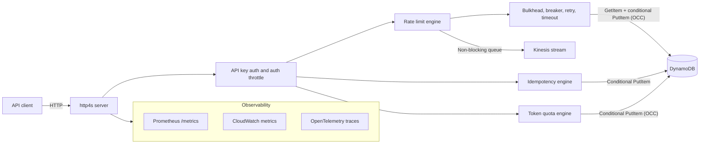
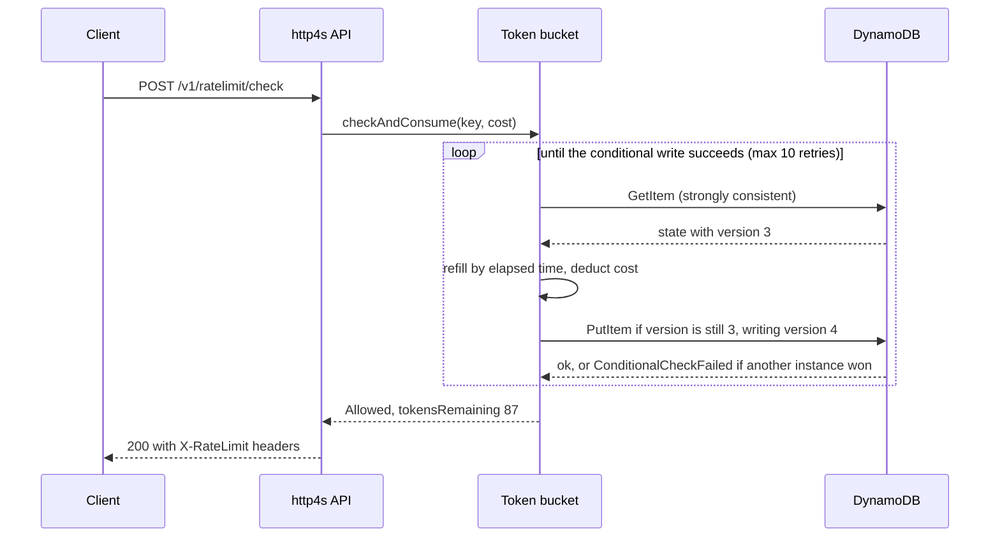

# Gate — Distributed Rate Limiting & Compliance Platform

[](https://opensource.org/licenses/MIT)
[](https://www.scala-lang.org/)
[](https://github.com/saintparish4/gate/actions/workflows/ci.yml)

A distributed rate limiter, idempotency service, and LLM token quota engine
built with Scala 3, Cats Effect, http4s, and DynamoDB. It enforces per-key
request limits and multi-level token quotas correctly across any number of
stateless instances, without a lock service.

Gate is at **0.1.0**. The three correctness properties it exists to provide are
checked in CI against a full local stack on every change, and were validated on
2026-09-14 against the Terraform-deployed stack on AWS: one Fargate task, real
DynamoDB, zero errors. See [Correctness](#correctness).

### Why Gate

- **Public or partner APIs** — per-key RPS and burst limits, sized by the
  client's tier, across many stateless containers, with one source of truth in DynamoDB
  ([token bucket + OCC](#optimistic-concurrency-control-flow)).
- **AI / LLM gateways** — stack request limits with user / agent / org token
  quotas so spend and abuse stay bounded ([token quotas](#token-quotas)).
- **Money-moving or side-effecting workflows** — idempotency keys so retries
  and double-clicks do not double-charge or double-ship ([idempotency](#idempotency)).

### What this system guarantees

| Guarantee | Mechanism |
|-----------|-----------|
| **At most X requests per client and key, across every instance** | One token-bucket item per client and key in DynamoDB. Every consume is a strongly consistent `GetItem` followed by a `PutItem` conditioned on the item's `version`, so only one instance wins each state change. Up to 10 conflicting writes are retried with jittered backoff; after that the request is **rejected** (429, `Retry-After: 1`). The service under-issues at the tail rather than over-issuing past the limit. |
| **Idempotent operations within a TTL** | First writer wins via a conditional `PutItem` (`attribute_not_exists(pk)`). Replays within the TTL get the stored response. A SHA-256 fingerprint of the request body turns a same-key different-body replay into `409 Conflict`. DynamoDB TTL expires the items. |
| **Multi-level token quotas** | User, agent, and org quotas are enforced together on every check. The agent quota is clamped to 80% of the user quota. A check reserves an estimate and returns a `reservationId`; reconcile replaces the stored estimate with actual usage, once, and never takes an estimate from the caller. |
| **Tenants never share state** | Every storage key is scoped to the authenticated client ([ADR-005](docs/adr/005-tenant-namespaced-storage-keys.md)). Two clients sending the same rate-limit key, idempotency key, or quota user get separate buckets, records, and counters. Completing or failing an idempotency record also requires the client that created it. `HttpApiIntegrationSpec` drives all seven routes with two clients on the same keys. |
| **Stateless instances** | All rate-limit, idempotency, and quota state lives in DynamoDB. Any instance can serve any request; a crash loses nothing. |

### What this system is designed to survive

| Failure mode | Behaviour |
|-------------|-----------|
| **DynamoDB slow or partially down** | The rate-limit store is wrapped in a bulkhead (100 concurrent calls, 500 ms max wait), a process-wide circuit breaker (20 failures to open, 30 s reset, 3 half-open calls), a retry policy for SDK and I/O errors (3 retries, 100 ms base, 2x backoff, 10 s cap), and a 2 s timeout per check. A timed-out check is not retried: the bound covers the whole check. When a check reaches no decision (the breaker is open, the bulkhead is full, or the store times out or fails after retries), `DEGRADATION_MODE` decides: `reject-all` (default, safe for payments) or `allow-all` (for AI infrastructure where availability wins). Every degraded decision carries `X-Gate-Degraded: true` and increments `gate_degraded_total`. `GET /v1/ratelimit/status` answers `503` when the store cannot be read, rather than reporting a full bucket. |
| **A corrupt limiter or quota item** | It fails closed and self-heals. The store replaces the item, conditioned on its raw stored version, with the most conservative valid state: an empty token bucket, a full leaky bucket or sliding window, an exhausted quota window starting now. The key refuses until it refills, drains, or the window ends. Each read counts `CorruptStateRead`, which has an alarm. A corrupt idempotency record answers `503`, since whether its operation ran is unknowable. |
| **Instance crash** | No in-process state. The next instance reads current DynamoDB state and continues correctly. |
| **Kinesis failure** | Events go into a bounded in-memory queue (10,000, drop-oldest) that a background fiber drains to Kinesis. A failed publish is retried once, then dropped. Both an eviction from a full queue and a failed publish are counted, as `gate_events_dropped_total` and CloudWatch `DroppedKinesisEvent{reason=queue_full\|publish_failed}`. The request path never waits on Kinesis, and `/ready` reports a Kinesis fault as `degraded` without taking the task out of service. |
| **OCC exhaustion on a hot key** | After 10 failed conditional writes the request is rejected with 429 instead of over-issuing. |
| **Idempotency TOCTOU race** | If the conditional create fails and the follow-up read finds nothing (TTL deleted the item in between) or a `Failed` record (released in between), the check claims again, up to 3 times, instead of returning a `new` it does not own. |

The breaker and retry wrap the rate-limit store only. The idempotency and quota
stores each have their own bulkhead and timeout (2 s and 5 s; the quota bound
covers its own conditional-write retry loop). A store failure on either
answers `503` with `storage_unavailable`, and quota contention answers `503`
with `Retry-After: 1`.

### Scope

What the code does today, what exists only in part or on paper, and what is
deliberately out of scope for now.

| Area | Implemented | Planned | Excluded |
| --- | --- | --- | --- |
| Rate limiting | Token bucket, leaky bucket, and sliding window on DynamoDB with OCC; profiles by client tier; `/status` | | A fourth algorithm |
| Idempotency | Conditional claim, replay, request-hash conflicts, `/complete`, `/fail`, a 350 KB stored-response cap | | Streaming replay (SSE capture, partial replay, body offload) |
| Token quotas | User, agent, and org fixed windows; reserve, then reconcile against the stored reservation | | |
| Tenancy | Every storage key scoped to the authenticated client ([ADR-005](docs/adr/005-tenant-namespaced-storage-keys.md)), with cross-tenant tests and invariant D | | Hosted multi-tenant service: accounts, billing, a managed control plane |
| Access | API keys from Secrets Manager, a permission per route, a per-task throttle per key and on unknown keys per source | Audit records for failed authentication and permission refusals | SSO and role management |
| Failure behavior | Resilience stack on the rate-limit path; timeout and bulkhead on idempotency and quota; corrupt state fails closed and self-heals | | Serving decisions from a local cache during an outage |
| Events and audit | Kinesis events at most once; `AUDIT` log lines | Firehose to S3 (Parquet), Glue, Athena, and 7-year retention: in Terraform, never deployed ([COMPLIANCE.md](docs/COMPLIANCE.md)) | |
| Consistency | One AWS Region is the consistency boundary | A written statement of the single-region semantics | Exact limits across Regions (global tables) |
| Evidence | Invariants A-D in CI and against a Terraform deploy on AWS; LocalStack latency figures | A benchmark report on real AWS | |
| Interfaces | HTTP API; a local demo dashboard (Terraform pins it off) | | A product web UI or admin console |

## Architecture


```mermaid
flowchart LR
    Client[API client] -->|HTTP| Server[http4s server]
    Server --> Auth[API key auth and auth throttle]
    Auth --> RL[Rate limit engine]
    Auth --> Idem[Idempotency engine]
    Auth --> Quota[Token quota engine]
    RL --> Res[Bulkhead, breaker, retry, timeout]
    Res -->|"GetItem + conditional PutItem (OCC)"| DDB[(DynamoDB)]
    Idem -->|"Conditional PutItem"| DDB
    Quota -->|"Conditional PutItem (OCC)"| DDB
    RL -->|"Non-blocking queue"| Kinesis[Kinesis stream]
    subgraph obs [Observability]
        Prom[Prometheus /metrics]
        CW[CloudWatch metrics]
        OTel[OpenTelemetry traces]
    end
    Server --> obs
```

### Optimistic Concurrency Control Flow

The rate limiter never locks. Each check reads the bucket, computes the new
state locally, and writes it back only if nobody else has written since.


```mermaid
sequenceDiagram
    participant C as Client
    participant API as http4s API
    participant TB as Token bucket
    participant DB as DynamoDB

    C->>API: POST /v1/ratelimit/check
    API->>TB: checkAndConsume(key, cost)
    loop until the conditional write succeeds (max 10 retries)
        TB->>DB: GetItem (strongly consistent)
        DB-->>TB: state with version 3
        TB->>TB: refill by elapsed time, deduct cost
        TB->>DB: PutItem if version is still 3, writing version 4
        DB-->>TB: ok, or ConditionalCheckFailed if another instance won
    end
    TB-->>API: Allowed, tokensRemaining 87
    API-->>C: 200 with X-RateLimit headers
```

A conflict means another instance consumed from the same bucket between the
read and the write. The loser re-reads and recomputes, so tokens are never
double-spent. Refill is driven by wall-clock time stored in the item, because
the state is shared across tasks; `core.TokenBucket` bounds what a clock
correction on one host can do (a backward step deducts nothing and never moves
`lastRefillMs` backward; a forward step mints at most `rate x step` once).

Design rationale: [ARCHITECTURE.md](docs/ARCHITECTURE.md) and the
[ADRs](docs/adr/).

## Quickstart

Prerequisites: Docker with Compose v2 (`docker compose`; the Makefile uses
`--wait`). JDK 17 and sbt only if you want to run the app outside Docker. No
AWS account needed.

```bash
make stack      # LocalStack (DynamoDB + Kinesis) and the app, both in Docker
make health     # prints /health, /ready and a sample rate-limit status
make            # lists every target
```

`make dev` starts LocalStack and runs the app with `sbt run` instead. LocalStack
is pinned to 4.14.0 and its init script creates the three tables and the
stream; both images bake in code, and the LocalStack volume survives
`make down`. If a checkout changes underneath a running stack, reset it with
`make clean && make stack`. The tell is `/health` reporting a version that
disagrees with `build.sbt`, or the correctness invariants failing with a flood
of HTTP 500s.

**1. Liveness and readiness**

```bash
curl -s http://localhost:8080/health
# {"status":"healthy","version":"0.1.0","commit":"23fb85b"}
curl -s http://localhost:8080/ready
# {"status":"ok","components":[{"name":"dynamodb_ratelimit","status":"ok","required":true,"details":null}, ...]}
```

`/health` is liveness only and answers 200 whenever the process is up.
`/ready` pings the DynamoDB tables (rate-limit, idempotency, and the quota
table when quotas are on) and the Kinesis stream. It answers 503 with
`"status":"unavailable"` only when a table is unreachable, because that is when
the service cannot decide anything. Kinesis is optional: events are
fire-and-forget, and no request waits on them, so a Kinesis fault reads
`"status":"degraded"` with a 200 and the task stays in service. The ALB target
group routes on `/ready`, and the deploy script waits for `"status":"ok"`.

**2. A rate-limit check**

Three API keys are built in for development: `test-api-key` (premium tier,
1,000 tokens), `free-api-key` (free tier, 20 tokens), and `admin-api-key`
(enterprise tier, the only one allowed to read `/metrics`). They are public, so
the service serves them only with `ALLOW_BUILT_IN_KEYS=true`, which
docker-compose and `make run` set. With neither that flag nor Secrets Manager,
it refuses to start.

```bash
curl -s -X POST http://localhost:8080/v1/ratelimit/check \
  -H "Content-Type: application/json" \
  -H "Authorization: Bearer test-api-key" \
  -d '{"key": "user:demo", "cost": 1}' | jq .
```

```json
{
  "allowed": true,
  "tokensRemaining": 999,
  "retryAfter": null,
  "limit": 1000,
  "resetAt": "2026-09-14T10:30:05Z",
  "message": null,
  "error": null
}
```

Allowed responses carry `X-RateLimit-Limit`, `X-RateLimit-Remaining`, and
`X-RateLimit-Reset` (epoch seconds). Every response from a route, including authentication's 401, 403 and 429, echoes `X-Request-Id`; the 400/422 body-decoding answers and a 404 for an unknown path do not.

**3. Exhaust a bucket**

The free tier holds 20 tokens and refills 2 per second, so 40 quick requests
drain it:

```bash
for i in $(seq 1 40); do
  curl -s -o /dev/null -w '%{http_code}\n' -X POST http://localhost:8080/v1/ratelimit/check \
    -H "Content-Type: application/json" \
    -H "Authorization: Bearer free-api-key" \
    -d '{"key": "user:demo", "cost": 1}'
done | sort | uniq -c
```

Roughly the first 20 answer 200; the rest answer 429 with a `Retry-After`
header and this body:

```json
{
  "allowed": false,
  "tokensRemaining": null,
  "retryAfter": 1,
  "limit": 20,
  "resetAt": "2026-09-14T10:30:05Z",
  "message": "Rate limit exceeded"
}
```

**4. Idempotency**

```bash
curl -s -X POST http://localhost:8080/v1/idempotency/check \
  -H "Content-Type: application/json" \
  -H "Authorization: Bearer test-api-key" \
  -d '{"idempotencyKey": "payment:demo-001", "ttl": 3600}' | jq .
# {"status":"new","idempotencyKey":"payment:demo-001"}          (200)
```

Send it again and the answer is `{"status":"in_progress", ...}` with HTTP 202:
the first operation has not completed, so the client must not run the payment
twice. Store the result with `POST /v1/idempotency/payment:demo-001/complete`
and a body of `{"statusCode": 200, "body": "..."}`; from then on replays answer
`{"status":"duplicate", ...}` with the stored response. A replay whose
`requestBody` hashes differently answers `409` with `"status":"conflict"`. If
the operation fails without effect, `POST /v1/idempotency/payment:demo-001/fail`
releases the key, and the next check answers `new` again.

**5. Token quota**

Compose and the Terraform demo both set `TOKEN_QUOTA_ENABLED=true`. When it is
off, the quota routes answer 404.

```bash
curl -s -X POST http://localhost:8080/v1/quota/check \
  -H "Content-Type: application/json" \
  -H "Authorization: Bearer test-api-key" \
  -d '{"userId": "user:alice", "agentId": "agent:planner", "orgId": "org:acme", "estimatedInputTokens": 500}' | jq .
```

```json
{
  "allowed": true,
  "remainingTokens": { "user": 999500, "agent": 499500, "org": 9999500 },
  "exceededLevel": null,
  "retryAfter": null,
  "reservationId": "5f0c2a6e-8a53-4c43-9f53-8f0d7e1f3b0a"
}
```

After the LLM call, send the `reservationId` with the actual token counts:

```bash
curl -s -X POST http://localhost:8080/v1/quota/reconcile \
  -H "Content-Type: application/json" \
  -H "Authorization: Bearer test-api-key" \
  -d '{"reservationId": "5f0c2a6e-8a53-4c43-9f53-8f0d7e1f3b0a", "actualInputTokens": 420, "actualOutputTokens": 180}' | jq .
```

Reconcile replaces the estimate stored with the reservation, so it can only
give back that reservation's own charge, and it applies once.

**6. Metrics**

```bash
curl -s -H "Authorization: Bearer admin-api-key" http://localhost:8080/metrics | grep '^gate_'
```

## API

| Method | Path | Permission | Description |
|--------|------|------------|-------------|
| `POST` | `/v1/ratelimit/check` | `RateLimitCheck` | Consume `cost` tokens (default 1) for `key`; optional `profile` and `endpoint` |
| `GET` | `/v1/ratelimit/status/:key` | `RateLimitStatus` | Current bucket state for a key, without consuming |
| `POST` | `/v1/idempotency/check` | `IdempotencyCheck` | `new` (200), `in_progress` (202), `duplicate` (200) or `conflict` (409) |
| `POST` | `/v1/idempotency/:key/complete` | `IdempotencyComplete` | Store the response for a key; 409 if it is not pending; 413 if the response, encoded, is over 350 KB |
| `POST` | `/v1/idempotency/:key/fail` | `IdempotencyComplete` | Release a pending key so a retry is `new`; 409 if it is not pending |
| `POST` | `/v1/quota/check` | `QuotaCheck` | Pre-request user / agent / org quota check; 429 with `Retry-After` when exceeded |
| `POST` | `/v1/quota/reconcile` | `QuotaReconcile` | Post-response reconciliation of estimated versus actual tokens |
| `GET` | `/health` | none, unauthenticated | Liveness |
| `GET` | `/ready` | none, unauthenticated | Readiness: 503 only when a DynamoDB table is unreachable; a Kinesis fault is a 200 `degraded` |
| `GET` | `/metrics` | `AdminMetrics` | Prometheus text exposition |
| `GET` | `/v1/ratelimit/dashboard/stats` | none, unauthenticated | Server-sent events stream of rate-limit decisions; only with `DASHBOARD_ENABLED=true` |
| `GET` | `/dashboard` | none, unauthenticated | Demo dashboard page, backed by `/dashboard/api/*`; only with `DASHBOARD_ENABLED=true` |

Authentication accepts `Authorization: Bearer <key>`, `Authorization: ApiKey
<key>`, or an `X-Api-Key` header. A missing or unknown key answers 401 with an
empty body. A valid key without the route's permission answers 403 naming the
permission, before the route touches any state. The built-in `test-api-key`
and `free-api-key` hold the six standard permissions; `admin-api-key` also
holds `AdminMetrics`. Each key is also throttled to
`AUTH_RATE_LIMIT_PER_MINUTE` authentications (default 1,000); past that the
answer is **429** with `Retry-After`, distinct from a bucket rejection. A
source that presents more than 20 unknown keys in a minute gets the same 429,
for any key, until the minute ends.
Malformed JSON answers 400 and JSON that does not match the schema answers
422.

The dashboard routes are unauthenticated: `POST /dashboard/api/config`
rewrites the demo bucket's profile live, and the decision stream carries every
client's key ID. They are off unless `DASHBOARD_ENABLED=true`, which only
docker-compose sets; Terraform pins it to `false`. With the flag off the routes
are not served at all.

Full request and response schemas: [API.md](docs/API.md).

## Configuration

Everything is in [`application.conf`](src/main/resources/application.conf);
each setting has an environment-variable override. A value Gate cannot honour
(an unknown degradation mode, an invalid profile, an agent quota above 80% of
the user quota, no API key source, an unknown algorithm or storage backend, a
value of the wrong type) stops startup with `Refusing to
start: ...` rather than running on defaults. The ones that matter most:

| Env var | Default | Notes |
|---|---|---|
| `SERVER_PORT` | `8080` | |
| `USE_LOCALSTACK` / `AWS_ENDPOINT` | `false` / unset | Compose points both at `http://localstack:4566` |
| `RATE_LIMIT_TABLE` / `IDEMPOTENCY_TABLE` / `TOKEN_QUOTA_TABLE` | `rate-limits` / `idempotency` / `gate-token-quotas` | LocalStack names; Terraform passes its own (see [Deploying](#deploying-to-aws)) |
| `KINESIS_STREAM` | `rate-limit-events` | Same split as the tables |
| `RATE_LIMIT_ALGORITHM` | `token-bucket` | Or `leaky-bucket` or `sliding-window`; anything else stops startup |
| `RATELIMIT_DEFAULT_CAPACITY` / `RATELIMIT_DEFAULT_REFILL_RATE` | `100` / `10.0` | Used when no profile applies |
| `IDEMPOTENCY_DEFAULT_TTL` / `IDEMPOTENCY_MAX_TTL_SECONDS` | `86400` / `86400` | Client TTLs above the max are capped |
| `TOKEN_QUOTA_ENABLED` | `false` | Compose and the demo deploy set `true` |
| `TOKEN_QUOTA_USER_LIMIT` / `_AGENT_LIMIT` / `_ORG_LIMIT` | `1000000` / `500000` / `10000000` | Windows 1 h / 1 h / 24 h; agent is clamped to 80% of user |
| `KINESIS_ENABLED` / `KINESIS_QUEUE_SIZE` | `true` / `10000` | |
| `CIRCUIT_BREAKER_MAX_FAILURES` / `CIRCUIT_BREAKER_RESET_TIMEOUT` | `20` / `30 seconds` | One breaker for the whole rate-limit store |
| `BULKHEAD_MAX_CONCURRENT` | `100` | |
| `TIMEOUT_RATE_LIMIT_CHECK` / `TIMEOUT_IDEMPOTENCY_CHECK` / `TIMEOUT_QUOTA_CHECK` | `2s` / `2s` / `5s` | Compose raises all three to 10 s for LocalStack |
| `DEGRADATION_MODE` | `reject-all` | Or `allow-all`. Anything else, including the former `use-cached`, stops startup |
| `DASHBOARD_ENABLED` | `false` | Compose sets `true`; Terraform pins `false` |
| `AUTH_RATE_LIMIT_PER_MINUTE` | `1000` | Compose and the demo raise it to 10,000,000 for load runs |
| `SECRETS_MANAGER_ENABLED` | `false` | Terraform pins `true`. A missing or unreadable secret, or one with no active keys, stops startup |
| `ALLOW_BUILT_IN_KEYS` | `false` | Serves the public built-in keys. Compose and `make run` set it; Terraform never does |
| `METRICS_ENABLED` / `METRICS_NAMESPACE` / `METRICS_ENVIRONMENT` | `true` / `RateLimiter` / `dev` | CloudWatch publishing is off whenever `USE_LOCALSTACK=true` |
| `PROMETHEUS_ENABLED` | `true` | `/metrics` answers 404 to an admin key when off |
| `TRACING_ENABLED` | `true` | The OpenTelemetry SDK reads `OTEL_EXPORTER_OTLP_ENDPOINT` and `OTEL_SERVICE_NAME` itself |
| `STORAGE_BACKEND` | `dynamodb` | `in-memory` for single-process tests, not correct across instances; anything else stops startup |

### Rate-limit profiles

A client's tier selects its profile. A `profile` field on the check request
can only narrow it: naming a profile with a higher capacity or refill than the
tier's own answers **403** `profile_not_permitted` and consumes nothing, and an
unknown name answers 400. Invalid profiles fail startup.

| Profile | Capacity (burst) | Refill | TTL |
|---|---|---|---|
| `free` | 20 tokens | 2 / s | 1 h |
| `basic` | 100 tokens | 10 / s | 1 h |
| `premium` | 1,000 tokens | 100 / s | 1 h |
| `enterprise` | 10,000 tokens | 1,000 / s | 1 h |

### Token quotas

| Level | Default limit | Window |
|---|---|---|
| `user` | 1,000,000 tokens | 1 hour |
| `agent` | 500,000 tokens (at most 80% of user) | 1 hour |
| `org` | 10,000,000 tokens | 24 hours |

Quota counters are updated with the same conditional-write pattern as the
token bucket, with up to 25 attempts before answering 503.

### Idempotency

One item per key (`idempotency#<key>`), strongly consistent reads, TTL set at
creation. The first successful create answers `new`; while it is pending,
replays answer `in_progress`; after `/complete`, replays answer `duplicate`
with the stored response. A replay whose `requestBody` hashes differently
answers `conflict` (409).

`/fail` releases a pending key after its operation failed without effect, so
the next check claims it again. Without it a failed key stayed pending until
its TTL. `/complete` and `/fail` apply only to a pending record created by the
same client, so a completed operation is never reopened.

The stored response is inline in the DynamoDB item, and a replay returns it
whole: nothing is streamed. `/complete` refuses a response over 350 KB, as
encoded JSON, with `413 response_too_large`, because a DynamoDB item holds at
most 400 KB. The key stays pending; store a reference to the result instead.

## Observability

```bash
make obs        # the stack plus Prometheus, Grafana and Jaeger
```

| Tool | URL | Notes |
|---|---|---|
| Grafana | <http://localhost:3000> | `admin` / `admin`, anonymous viewer enabled; dashboard "Gate — Rate Limiting & Quotas" |
| Prometheus | <http://localhost:9090> | Scrapes the app every 5 s with the development `admin-api-key` |
| Jaeger | <http://localhost:16686> | Service `gate`; compose points the OTLP exporter at it |

The dashboard source is
[`observability/grafana/dashboards/gate.json`](observability/grafana/dashboards/gate.json).

**Prometheus metrics** (`GET /metrics` with an `AdminMetrics` key)

| Metric | Type | Labels |
|---|---|---|
| `gate_requests_total` | counter | `tier`, `result` (`allowed` / `rejected`); rate-limit checks answered by the API |
| `gate_rate_limit_check_seconds`, `gate_idempotency_check_seconds`, `gate_token_quota_check_seconds` | histogram | end-to-end latency per endpoint |
| `gate_dynamodb_latency_seconds` | histogram | `operation` (`checkAndConsume`, `getStatus`, `idempotency_check`, `quota_reserve`); store-call latency, including conditional-write retries |
| `gate_circuit_breaker_state` | gauge | `name`; 0 closed, 0.5 half-open, 1 open |
| `gate_degraded_total` | counter | `reason` (`circuit_breaker`, `bulkhead`, `error`) |
| `gate_idempotency_total` | counter | `result` (`new`, `in_progress`, `duplicate`, `conflict`, `error`) |
| `gate_token_quota_total` | counter | `level`, `result` (`exceeded`, `contended`, `reconcile_failed`) |
| `gate_quota_tokens_admitted_total` | counter | `level`; tokens reserved by admitted quota checks, i.e. the pre-request estimate |
| `gate_events_published_total` | counter | `event_type`; counted once a Kinesis put succeeds |
| `gate_events_dropped_total` | counter | Kinesis events dropped after the retry |

The bounded label combinations exist at zero from startup, so a quiet series
reads 0 rather than "No data".

**CloudWatch** (namespace `RateLimiter`, off under LocalStack): `RateLimitAllowed`,
`RateLimitRejected`, `RateLimitOCCAttempts`, `RateLimitCheckLatency`,
`RateLimitDegraded`, `CircuitBreakerState`, `DroppedKinesisEvent`,
`CorruptStateRead`, `TokenQuotaExceeded`, `TokenQuotaContended`,
`TokenQuotaOCCRetry`, `QuotaTokensAdmitted`, `IdempotencyCheck`,
`IdempotencyStoreLatency`, `TokenQuotaStoreLatency`, `KinesisEventPublished`.
Every datum carries an `Environment` dimension from `METRICS_ENVIRONMENT`
(Terraform sets it to the deployment's environment). Data points are buffered
and flushed every `metrics.flush-interval` (60 s), at 1,000 buffered entries,
and on shutdown; the buffer caps at 50,000 and drops the oldest. The Terraform
CloudWatch dashboard and alarms query the names and dimensions the app emits,
and `make monitoring-check` (run in CI) fails if a referenced metric is not
emitted or omits `Environment`. The circuit-breaker gauge is recorded after
every protected call, so it reads open while the breaker is open.

**Tracing** uses otel4s over the OpenTelemetry Java SDK. Spans wrap every
route and each rate-limit, idempotency, and quota operation; the trace ID is
copied into the Kinesis event. Configure the exporter with the standard
`OTEL_*` environment variables. On AWS, Terraform disables the SDK unless
`otel_exporter_otlp_endpoint` is set, because there is no collector in the
demo stack.

## Correctness

### In CI

[`ci.yml`](.github/workflows/ci.yml) runs three jobs in parallel on every push
and pull request:

1. **unit** — the compose-versus-Terraform environment drift check first (it
   needs only bash), then `scalafmtCheckAll`, compile, and unit tests.
2. **integration** — the integration suite against TestContainers LocalStack.
3. **correctness** — brings the compose stack up and waits for `/ready`. It
   smoke-tests `/health`, one rate-limit call, and one idempotency call, then
   runs `sbt "loadSim/run --scenario correctness"`. Anything but a pass fails the
   build.

The correctness scenario warms the server for about 15 s, then asserts four
invariants:

| Invariant | Load | Assertion |
|---|---|---|
| **A** — token bucket never over-issues | 20 workers on one `free-api-key` bucket for 30 s | `allowed <= capacity + refill x (window + 2 s)`, `errors = 0`, no answer marked `X-Gate-Degraded`. The window is the span of the server's `Date` headers, because the bucket refills on the server's clock; the 2 s is that header's one-second resolution plus the first request's latency. Without `Date` headers it falls back to this machine's clocks, and is inconclusive if they disagree by more than 1%. |
| **B** — idempotency creates exactly once | 50 workers all on one key for 30 s, and the key changes every 250 ms: about 120 first-claim races | every key answered `new` exactly once, 0 conflicts, 0 errors |
| **C** — token quota never over-admits | 50 workers spending 25,000 tokens each against one user's 1,000,000 limit for 20 s, moving to a fresh user once it has refused 50 checks (up to 10 users) | for every user `admitted x 25,000 <= 1,000,000`; at least one user reached its limit; 0 errors |
| **D** — tenants never share state | Two clients (`API_KEY` and `FREE_API_KEY`) racing for 20 s on the same idempotency key, which changes every 250 ms, and the same quota user, while the second reconciles every reservation the first is granted | each client is answered `new` exactly once for every key; each is held to 40 quota admissions and together they pass 40; every stolen reconcile answers 404; 0 conflicts, 0 errors |

The invariants are themselves tested: `sbt loadSim/test` runs each one against
a small fake server that is correct, and against fakes with one bug each (a
limiter that admits everything, a server that says `new` to everyone, a quota
with no limit, state shared between clients). The correct one must pass, each
bug must be a `VIOLATION`, and a server that only errors must be
`INCONCLUSIVE`. Until then the scenario had only ever failed on errors.

B and D used to hold 10 keys for the whole run, which is ten races in the first
instant and duplicates after that, and C used one user, which crosses its limit
once. B also compared the total of `new` answers with the number of keys, which
one key claimed twice and one never claimed would have satisfied. The AWS
tables below were measured with that earlier load.

Each invariant ends in one of three verdicts, and the run exits with the worst
of them:

| Verdict | Exit | Meaning | Detail prefixes |
|---|---|---|---|
| `PASS` | 0 | The property held, and the run was able to show it | |
| `VIOLATION` | 1 | The property was broken | `OVER-ISSUE`, `UNDER-ISSUE`, `DOUBLE CLAIM`, `NEVER CLAIMED`, `CONFLICT`, `OVER-ADMISSION`, `SHARED IDEMPOTENCY`, `SHARED QUOTA`, `CROSS-TENANT RECONCILE` |
| `INCONCLUSIVE` | 2 | The run cannot say: requests errored, answers came from degradation mode, or a limit was never reached | `DEGRADED`, `VACUOUS`, or an error count |

The two used to share one word, `FAIL`, so a run with eight timed-out requests
and no broken invariant read as two failed invariants. `make correctness`
runs it locally; `make APP_URL=http://<host> correctness` runs it against any
deployment. A counts the answers that carry `X-Gate-Degraded`, so a decision
made by degradation mode is seen whichever task made it. It used to compare
`gate_degraded_total` before and after, which meant nothing behind two tasks. A
drains `FREE_API_KEY`'s bucket, B and C use `API_KEY`, and D needs both, as two
different clients. Against a deployed stack both come from `.demo-keys.env`,
and they reach the load simulator through the environment: as command-line
flags they were echoed by `make` and by sbt, so a run printed them. Source:
[`LoadSim.scala`](loadSim/src/main/scala/LoadSim.scala).

### On AWS

Two runs, each from a laptop over the internet against the Terraform-deployed
demo stack: one Fargate task (1024 CPU units / 2048 MB), DynamoDB on-demand,
us-east-1. Two passing runs are evidence, not a reliability history.

**2026-09-27, run `1790555564135`, all four invariants.** This demo:
- loaded its keys from Secrets Manager, written by `deploy-demo.sh`, and
  answered 401 to the built-in `test-api-key`;
- served HTTP only to the deployer's IP;
- ran with every storage key scoped per client.

Zero errors on every invariant.

| Invariant | Result | Detail | Throughput |
|-----------|--------|--------|------------|
| A — token bucket never over-issues | **PASS** | `allowed=78` within `20 <= 78 <= 91`; 5,281 blocked, 0 errors, `server-excess = -1.0 s` | ~178 RPS |
| B — idempotency, exactly one `new` per key | **PASS** | `created=10` of 10 keys; 6,840 duplicates, 0 conflicts, 0 errors | ~228 RPS |
| C — token quota never over-admits | **PASS** | `admitted=40 x 25,000 = 1,000,000`, the limit; 6,933 rejected, 0 errors | ~348 RPS |
| D — tenants never share state | **PASS** | each client created its own 10 records and got its own 40 admissions (80 together); 974 of 974 cross-client reconciles refused; 0 conflicts, 0 errors | ~306 RPS |

**2026-09-14, run `1789440743789`, invariants A-C** (D did not exist yet).
Zero errors, no degradation-mode decisions, every request served by the token
bucket.

| Invariant | Result | Detail | Throughput |
|-----------|--------|--------|------------|
| A — token bucket never over-issues | **PASS** | `allowed=80` against a physical ceiling of `20 + 2.0 x 30.0 s = 80`; exact. 5,951 blocked, 0 errors. | ~201 RPS |
| B — idempotency, exactly one `new` per key | **PASS** | `created=10` of 10 keys under 50 concurrent writers; 8,076 duplicates, 0 conflicts, 0 errors. | ~269 RPS |
| C — token quota never over-admits | **PASS** | `admitted=40 x 25,000 = 1,000,000`, the limit, not a token over. 7,541 rejected, 0 errors. | ~379 RPS |

Invariant A measured `server-excess = -0.0 s` on this run. An earlier run
measured `+2.9 s`. That was read as a wall-clock correction on the task, and
the invariant was given a 5 s allowance to absorb it, which is 10 tokens on a
budget of 80. On 1 October 2026 every run driven from one laptop showed 1.0 to
1.5 s of the same excess, against a local server and against AWS, and 14 CI
runs showed none; that laptop's monotonic clock measured 3.2-3.5% slow against
an outside clock. The load generator had under-measured its own window. The
invariant now reads the window from the server's `Date` headers, with a 2 s
allowance. The September figures above stand as that version printed them.

The properties hold on real DynamoDB under contention, not just on the
emulator. Throughput here is bounded by the client and the WAN, not the
service; treat it as a floor. This is a correctness run, not a latency
benchmark.

## Performance

Fixed-RPS latency figures, measured with the `latency` load scenario against
LocalStack on a laptop, are in [PERFORMANCE.md](docs/PERFORMANCE.md). The
representative warm-path row is 1,000 target RPS: 948 achieved, p50 6.9 ms,
p95 59.5 ms, p99 217.7 ms, 0% errors. Each decision costs exactly one
strongly consistent read and one conditional write, about $1.50 per million
checks on DynamoDB on-demand, rising toward $12.75 per million in the
worst case of 10 conflict retries per check.

The cost of correctness without a lock shows up on a single hot key. With 50
virtual users hammering one key, throughput drops from about 50 RPS to 4 to 8
RPS and p99 latency reaches 13 s, because most conditional writes fail and
re-read. The service stays safe, never over-issuing, and pays in throughput
and tail latency on that one key. `RateLimitOCCAttempts` in CloudWatch shows
it happening.

**Load tools**

```bash
sbt "loadSim/run --scenario normal"                       # 20 VUs, 500 keys, 60 s
sbt "loadSim/run --scenario highContention"               # 50 VUs, 1 key, 60 s
sbt "loadSim/run --scenario latency --rps 1000 --duration 60"
./scripts/load-test.sh dev quick                           # k6: quick | smoke | baseline | stress | spike | soak | highContention
```

Other loadSim scenarios: `burst` (50 VUs, 50 keys), `idempotency` (30 VUs, 5
shared keys), `realistic` (40 VUs, 80/20 rate-limit/idempotency mix),
`correctness`. All take `--url` and start with a `/health` preflight.

## Deploying to AWS

Two Terraform roots, both keeping state in S3. They need Terraform 1.10 or
later for S3 state locking; 1.11 is the first release where it is not
experimental.

- [`terraform/bootstrap/`](terraform/bootstrap/) holds what outlives every
  environment: the `gate` ECR repository and its lifecycle policy (tags are
  immutable, scanned on push; untagged images expire after a day, and only the
  10 most recent are kept). `scripts/bootstrap.sh` applies it once per account.
  It also creates the state bucket, `gate-tfstate-<account-id>` (versioned,
  encrypted, public access blocked, TLS only), and adopts an ECR repository
  made by an older `publish-image.sh` instead of recreating it.
- [`terraform/`](terraform/) provisions each environment, under the state key
  `gate/<environment>/terraform.tfstate` and the prefix `<project>-<environment>`
  (`rate-limiter-demo-*` for the demo):

| Resource | What it does |
|---|---|
| DynamoDB `-rate-limits`, `-idempotency`, `-token-quotas` | On-demand tables, hash key `pk`, TTL on `ttl`, encryption at rest; point-in-time recovery in `prod` |
| Kinesis `-events` | Decision event stream, KMS-encrypted |
| ECS Fargate service + ALB | Target group health check on `/ready`, container health check on `/health`; CPU target-tracking autoscaling when enabled. HTTPS (TLS 1.2+) with an HTTP redirect when `certificate_arn` is set; otherwise HTTP only to `alb_ingress_cidrs` (see [TLS](#tls)) |
| VPC | Two AZs, private subnets for tasks, two NAT gateways, interface endpoints for ECR, CloudWatch Logs, Secrets Manager and Kinesis, a gateway endpoint for DynamoDB |
| CloudWatch | Log group `/ecs/<project>-<environment>` (7 days, 30 in `prod`), a dashboard, and five alarms (error rate, p99 latency, healthy tasks, circuit breaker open, corrupt state read); they notify only when `alarm_sns_topic_arn` is set |
| Secrets Manager | `<project>/<environment>/api-keys`, seeded with an inactive placeholder; the service refuses to start until it holds an active key |

Local and AWS resource names differ. The app reads them from the environment,
so compose and Terraform each pass their own:

| | LocalStack (compose) | AWS (Terraform, demo) |
|---|---|---|
| Rate-limit table | `rate-limits` | `rate-limiter-demo-rate-limits` |
| Idempotency table | `idempotency` | `rate-limiter-demo-idempotency` |
| Token-quota table | `gate-token-quotas` | `rate-limiter-demo-token-quotas` |
| Kinesis stream | `rate-limit-events` | `rate-limiter-demo-events` |

**Variables** ([`variables.tf`](terraform/variables.tf)); `container_image` is
the only one without a default:

| Variable | Default | Notes |
|---|---|---|
| `container_image` | required | ECR image URI |
| `aws_region` / `environment` / `project_name` | `us-east-1` / `dev` / `rate-limiter` | |
| `ecs_desired_count` / `ecs_cpu` / `ecs_memory` | `2` / `256` / `512` | The demo runs 1 task at 1024 / 2048; 256 / 512 managed 25 RPS |
| `enable_autoscaling` | `true` | `ecs_min_capacity` 2 to `ecs_max_capacity` 10 at 70% CPU. `dev.tfvars` sets `ecs_desired_count = 1` without turning this off, so the service scales back to 2 |
| `dynamodb_billing_mode` / `kinesis_shard_count` | `PAY_PER_REQUEST` / `1` | |
| `degradation_mode` | `reject-all` | |
| `circuit_breaker_max_failures` / `circuit_breaker_reset_timeout` | `20` / `30 seconds` | |
| `auth_rate_limit_per_minute` | `1000` | The demo raises it to 10,000,000 |
| `otel_exporter_otlp_endpoint` | `""` | Empty disables the tracing SDK on the task |
| `alarm_sns_topic_arn` | `""` | Empty means the alarms exist but notify nobody |
| `certificate_arn` | `""` | ACM certificate for the HTTPS listener |
| `alb_ingress_cidrs` | `["0.0.0.0/0"]` | Who may reach the ALB. `deploy-demo.sh` passes your IP |
| `allow_public_plaintext` | `false` | Required to serve HTTP to `0.0.0.0/0` without a certificate |

### Scripted demo

```bash
make env-drift tf-validate tf-test             # exit 0, or fix it before touching AWS
./scripts/bootstrap.sh                          # once per account: state bucket, ECR repository
export ECR_IMAGE=$(./scripts/publish-image.sh)  # builds linux/amd64, pushes, prints the URI
./scripts/deploy-demo.sh                        # writes demo API keys, applies demo.tfvars, waits for /ready
API=$(cd terraform && terraform output -raw api_endpoint)
source .demo-keys.env                           # the demo's keys; the built-in ones are refused on AWS
make APP_URL="$API" correctness
./scripts/teardown-demo.sh                      # terraform destroy, then fails if anything is left in state
```

`publish-image.sh` tags the image with the short git SHA, or the SHA plus
`-dirty-<timestamp>` when the tree has uncommitted changes, because tags are
immutable. It reuses a tag that is already pushed. Teardown leaves the ECR
repository, its images, and the state bucket, which belong to the bootstrap
root, and prints the NAT gateway, load balancer, and ECS cluster commands to
confirm nothing else survived. State is in S3, so any machine with
`terraform/backend.hcl` (written by `bootstrap.sh`) can deploy or tear down.

The demo costs roughly $0.30 per hour in `us-east-1`: two NAT gateways, five
interface endpoints across two AZs, an ALB, one 1 vCPU / 2 GB task, and one
Kinesis shard.

**Environment drift.** Four variables shipped set in `docker-compose.yml` and
absent from Terraform (`DEGRADATION_MODE`, `OTEL_EXPORTER_OTLP_ENDPOINT`,
`AUTH_RATE_LIMIT_PER_MINUTE`, then `SERVER_HOST` / `SERVER_PORT`), and each was
invisible locally precisely because compose set it. `scripts/check-env-drift.sh`
compares the `${?VAR}` overrides `application.conf` reads against what compose
and the Terraform `environment_variables` map set, exits 1 on a compose-only
variable, and runs as the first CI step.

### API keys on AWS

Every Terraform deploy loads its keys from Secrets Manager; the built-in keys
are refused outside docker-compose. Terraform creates the secret with one
inactive placeholder entry, and the service refuses to start until the secret
holds at least one active key. It also refuses to start if the secret is
missing or is not a JSON list of keys.

`deploy-demo.sh` handles this for the demo. It creates the secret first,
writes three random keys into it (premium, free, and admin, matching the
built-in set), saves them to `.demo-keys.env` (gitignored, mode 600), and only
then deploys the service. Re-running it keeps keys that are already active;
`teardown-demo.sh` deletes the file along with the secret.

For `dev` or `prod`, write keys before the first apply creates the service:

```bash
terraform init -backend-config=backend.hcl -backend-config="key=gate/prod/terraform.tfstate"
terraform apply -var-file=environments/prod.tfvars \
  -var="container_image=..." -target=module.secrets
aws secretsmanager put-secret-value \
  --secret-id "rate-limiter/prod/api-keys" \
  --secret-string '[{"apiKey":"...","apiKeyId":"key_001","clientName":"Client","tier":"basic","permissions":["ratelimit_check","ratelimit_status","idempotency_check","idempotency_complete","quota_check","quota_reconcile"],"active":true}]'
```

Every field is required, `active` included. Permission names are
`ratelimit_check`, `ratelimit_status`, `idempotency_check`,
`idempotency_complete`, `quota_check`, `quota_reconcile`, and `admin_metrics`;
tiers are `free`, `basic`, `premium`, and `enterprise`. An
entry with an unknown tier is skipped, and an unknown permission name is
dropped. The app composes the secret name from `SECRETS_PREFIX`,
`SECRETS_ENVIRONMENT`, and `API_KEYS_SECRET_NAME`, which Terraform sets to
match. Keys are re-read every 5 minutes. A refresh that cannot read the secret
keeps the current keys, while one that finds every key inactive revokes them
all.

### TLS

API keys travel in every request, and the ALB used to serve them over plain
HTTP to the whole internet.
- **With `certificate_arn`** (an ACM certificate for your domain; point the
  domain at the ALB), port 443 serves the API under a TLS 1.2+ policy, and
  port 80 only redirects to it.
- **Without one,** Terraform refuses a plan that serves plaintext to
  `0.0.0.0/0`. Restrict `alb_ingress_cidrs`, or set `allow_public_plaintext =
  true` to accept the risk on purpose.

The demo takes the restricted path: `deploy-demo.sh` lets in only your current
public IP, or `ALB_INGRESS_CIDR`. It serves HTTPS if you export
`CERTIFICATE_ARN`. `make tf-test` plans these rules against a mocked AWS
provider, and CI runs it.

### Other environments

`environments/dev.tfvars` and `environments/prod.tfvars` exist alongside
`demo.tfvars`. Each environment keeps its own state key. Without a
`certificate_arn`, they need `alb_ingress_cidrs` too:

```bash
cd terraform
terraform init -backend-config=backend.hcl -backend-config="key=gate/dev/terraform.tfstate"
terraform apply -var-file=environments/dev.tfvars \
  -var="container_image=ACCOUNT.dkr.ecr.REGION.amazonaws.com/gate:<tag>" \
  -var="certificate_arn=arn:aws:acm:REGION:ACCOUNT:certificate/..."
terraform output api_endpoint
```

## Documentation

- [API reference](docs/API.md) — request and response schemas for every route
- [Architecture](docs/ARCHITECTURE.md) — what the code does on each path, and why
- [Performance](docs/PERFORMANCE.md) — fixed-RPS latency and DynamoDB cost per decision
- [Compliance notes](docs/COMPLIANCE.md) — what the audit trail records today, and what is planned
- ADRs: [DynamoDB over Redis](docs/adr/001-dynamodb-over-redis.md),
  [hand-rolled circuit breaker](docs/adr/002-hand-rolled-circuit-breaker.md),
  [fire-and-forget event publishing](docs/adr/003-fire-and-forget-event-publishing.md),
  [OCC over pessimistic locking](docs/adr/004-occ-over-pessimistic-locking.md),
  [tenant-namespaced storage keys](docs/adr/005-tenant-namespaced-storage-keys.md),
  [idempotency claim token](docs/adr/006-idempotency-claim-token.md)

## Technology stack

Scala 3.7.4, Cats Effect 3.6.3, http4s 0.23.32, Circe 0.14.15, PureConfig
0.17.9, log4cats 2.7.1 on Logback, AWS SDK for Java 2.38.7 (DynamoDB,
Kinesis, CloudWatch, Secrets Manager), Prometheus simpleclient 0.16.0, otel4s
0.15.2 on the OpenTelemetry SDK 1.60.1, Caffeine 3.1.8. Tests use ScalaTest and
TestContainers. Built with sbt 1.12.0 into an `eclipse-temurin:17-jre` image;
LocalStack 4.14.0 for local AWS; Terraform for AWS.

```bash
make test        # unit tests
make test-it     # integration tests (TestContainers; needs Docker)
make fmt         # scalafmt; CI fails on unformatted code
```

## Contributing

Open an issue to discuss a change, then a pull request from a feature branch.
Every PR runs the full CI pipeline, including the correctness invariants.
