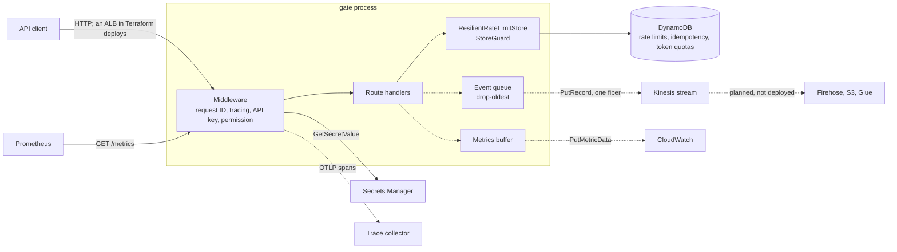

# Gate architecture

Gate is an HTTP service that makes three kinds of decisions for its callers: rate limits, idempotency (first writer wins, with response replay), and User/Agent/Org LLM token quotas (reserve, then reconcile). It is Scala 3.7.4 on Cats Effect 3.6.3 and http4s 0.23.32 (Ember), with circe, pureconfig, and the AWS SDK v2 ([build.sbt](../build.sbt)). All decision state lives in DynamoDB ([ADR-001](adr/001-dynamodb-over-redis.md)). Each instance keeps only per-process helpers: the auth throttle, the circuit breaker, the bulkheads, the event queue, the metrics buffer, the loaded API keys, and the dashboard's demo profile.

This document describes what the code does. Request and response formats are in [API.md](API.md); measured latency is in [PERFORMANCE.md](PERFORMANCE.md).

## System overview



Solid edges are needed to make a decision; dashed ones are off the decision path. Terraform ([terraform/](../terraform/)) runs the service on ECS Fargate behind an Application Load Balancer whose target group health check is `/ready`.

The Firehose delivery streams, S3 bucket, and Glue audit tables in [terraform/modules/kinesis/main.tf](../terraform/modules/kinesis/main.tf) are planned, not deployed. They are gated by `enable_kinesis_firehose` and `enable_audit_compliance`, both `false` by default, and no environment file turns them on. Nothing reads the Kinesis stream today.

## Packages and layers

| Package | Contents | Imports from |
| --- | --- | --- |
| `core` | Pure algorithms ([TokenBucket](../src/main/scala/core/TokenBucket.scala), [SlidingWindow](../src/main/scala/core/SlidingWindow.scala), `QuotaReservation.plan`, `QuotaReconciliation.plan`), decision ADTs, [TenantKey](../src/main/scala/core/TenantKey.scala), errors, and the store traits `RateLimitStore`, `IdempotencyStore`, `TokenQuotaStore` with their in-memory interpreters | `config`, `observability` (only [TokenQuotaService](../src/main/scala/core/TokenQuotaService.scala)) |
| `api` | [Routes](../src/main/scala/api/Routes.scala) and the handlers `RateLimitApi`, `IdempotencyApi`, `TokenQuotaApi`, `DashboardApi` | `core`, `config`, `events`, `observability`, `resilience`, `security` |
| `storage` | DynamoDB interpreters of the core traits, [DynamoDBOps](../src/main/scala/storage/DynamoDBOps.scala), [AwsClients](../src/main/scala/storage/AwsClients.scala) | `core`, `config`, `observability`, `resilience` |
| `resilience` | Circuit breaker, bulkhead, retry policies, degradation, `ResilientRateLimitStore`, `StoreGuard`, `HealthAggregator` | `core`, `config`, `observability` |
| `security` | API key middleware, permissions, auth throttle, Secrets Manager key store | `config` |
| `observability` | CloudWatch publisher, Prometheus registry, request-ID and tracing middleware | none |
| `events` | Event ADT, Kinesis publisher, dashboard broadcaster | `config`, `observability` |
| `config` | [AppConfig](../src/main/scala/config/AppConfig.scala) and its validation | `resilience` (the degradation-mode type) |
| `wiring`, `Main` | [StoreModule](../src/main/scala/wiring/StoreModule.scala), `SecurityModule`, `ObservabilityModule`, `Warmup`, and [Main](../src/main/scala/Main.scala) | everything |

`api` depends on store traits and never imports `storage`; only `wiring` and `Main` know the DynamoDB classes. `storage.backend = "in-memory"` swaps every store for its in-memory interpreter, which keeps state per process; `application.conf` describes it as the unit-test backend, and compose and Terraform leave it at `dynamodb`.

### Startup

`Main` builds the service as one `Resource` chain, released in reverse order at shutdown:

1. **Config.** pureconfig loads it and [`AppConfig.validate`](../src/main/scala/config/AppConfig.scala) checks it. Any error logs `Refusing to start` and stops the process. It rejects:
   - a rate-limit profile with an empty name, a capacity below 1, or a refill rate that is not positive;
   - an `agent-limit` above 80% of `user-limit` while quotas are on;
   - a `degradation-mode` other than `allow-all` or `reject-all`. `use-cached` gets its own message: no cache was ever wired in, so it failed open;
   - no API key source (neither Secrets Manager nor `allow-built-in-keys`);
   - an unknown `rate-limit.algorithm` or `storage.backend`. These used to fall back quietly to the token bucket and DynamoDB.
2. **Observability.** The CloudWatch publisher (only when `metrics.enabled` and not `aws.localstack`), the Prometheus registry, and the dashboard queue.
3. **Events.** The Kinesis publisher when `kinesis.enabled`, otherwise a no-op, wrapped by the dashboard broadcaster when `dashboard.enabled`.
4. **Stores.** The rate-limit store for the configured algorithm, wrapped in `ResilientRateLimitStore`; the idempotency store and (only when `token-quota.enabled`) the quota store, each wrapped in a `StoreGuard`. Each DynamoDB store gets its own SDK client with SDK retries disabled (`aws.client.disable-sdk-retries`), so every retry is gate's own and bounded.
5. **Warm-up** ([Warmup](../src/main/scala/wiring/Warmup.scala)). Five checks run against the raw rate-limit store on a throwaway key. Otherwise a cold instance pays JIT and SDK start-up on its first burst, every request exceeds the check timeout together, and that alone can open the circuit breaker. Failed warm-up calls are logged, not fatal.
6. **Tracer.** otel4s over the auto-configured OpenTelemetry SDK when `tracing.enabled`, otherwise a no-op.
7. **Security** ([SecurityModule](../src/main/scala/wiring/SecurityModule.scala)). With Secrets Manager on, the first key load must return at least one active key or startup fails. With `allow-built-in-keys`, the three public built-in keys are served with a warning. With neither, it fails again here, because a config built in code skips `validate`.
8. **Server.** The `/ready` sources, the routes, the middleware, and an Ember server on `server.host:server.port`, which drains in-flight requests for up to `server.shutdown-timeout` (30 s) at shutdown.

## Request path

Middleware, outermost first:

1. **`ErrorHandling`** (http4s), added in `Main`. A body that is not JSON is a 400, and one that does not match the schema is a 422. Without it an undecodable body was an empty 500.
2. **[CorrelationIdMiddleware](../src/main/scala/observability/CorrelationIdMiddleware.scala).** It takes `X-Request-Id` or generates a UUID, keeps it in an `IOLocal` for audit events, and echoes it on the response.
3. **[TracingMiddleware](../src/main/scala/observability/TracingMiddleware.scala).** One server span per request, with `http.method`, `http.target`, and `http.status_code`.
4. **Public routes** `/health` and `/ready`, then the dashboard routes when enabled. Neither goes through authentication.
5. **[ApiKeyAuth.middleware](../src/main/scala/security/ApiKeyAuth.scala).** It reads the key from `Authorization: Bearer <key>`, `Authorization: ApiKey <key>`, or `X-Api-Key`. A missing or unknown key gets a bare 401. A known key then passes the per-instance auth throttle: `security.authentication.rate-limit-per-minute` (1,000) requests per key, in a minute that starts at the key's first request. Over it, the answer is 429 with `Retry-After`, not 401, because the two need opposite client behavior: fix the credentials, or back off.
6. **Permission check** (`ApiKeyAuth.requirePermission`). A key without the route's permission gets 403 before any state is touched.

An unauthenticated request to an unknown path therefore gets 401; an authenticated one gets 404.

| Route | Permission | Notes |
| --- | --- | --- |
| `GET /health` | none | Liveness: always 200, with the version from sbt-buildinfo |
| `GET /ready` | none | 200 or 503; see [Health and readiness](#health-and-readiness) |
| `POST /v1/ratelimit/check` | `RateLimitCheck` | 200 allowed, 429 refused |
| `GET /v1/ratelimit/status/{key}` | `RateLimitStatus` | 503 when the store cannot be read |
| `POST /v1/idempotency/check` | `IdempotencyCheck` | 200 new or duplicate, 202 in progress, 409 conflict |
| `POST /v1/idempotency/{key}/complete` | `IdempotencyComplete` | 200, 409, or 413 |
| `POST /v1/idempotency/{key}/fail` | `IdempotencyComplete` | It ends the pending state as complete does, so it takes the same grant |
| `POST /v1/quota/check` | `QuotaCheck` | 404 when `token-quota.enabled` is false |
| `POST /v1/quota/reconcile` | `QuotaReconcile` | 404 when quotas are off |
| `GET /metrics` | `AdminMetrics` | 404 when Prometheus is off |
| `/dashboard`, `/dashboard/api/*`, `GET /v1/ratelimit/dashboard/stats` | none | Only with `dashboard.enabled`: off by default, on in compose, pinned off by Terraform |

The built-in keys are `test-api-key` and `free-api-key` (standard permissions) and `admin-api-key` (adds `AdminMetrics`). Secrets Manager keys are a JSON list in the secret `<secret-prefix>/<environment>/<api-keys-secret-name>`, and each key's `apiKeyId` is also its `clientId`. The key set is reloaded on the request path once `security.secrets.cache-ttl` (5 minutes) has passed. A failed reload keeps the current keys; a readable secret with no active keys takes effect, so revoking every key works.

## Rate limiting

A check names a `key` and a `cost` (default 1; zero or negative is a 400). The client's tier picks a profile from `rate-limit.profiles` (`free`, `basic`, `premium`, `enterprise`), falling back to the `default-*` values. A `profile` named in the request may only narrow the tier's own ([RateLimitApi.selectProfile](../src/main/scala/api/RateLimitApi.scala)). An unknown name is a 400, and one with a larger capacity or a faster refill is a 403: the named profile used to win outright, so a free key could ask for enterprise limits. The store receives `TenantKey(clientId, key)`.

### Algorithms

`rate-limit.algorithm` picks one store per deployment. All three use the rate-limit table.

| Algorithm | Store | Item | Decision |
| --- | --- | --- | --- |
| `token-bucket` (default) | [DynamoDBRateLimitStore](../src/main/scala/storage/DynamoDBRateLimitStore.scala) | `pk = ratelimit#<scoped key>`, `tokens`, `lastRefillMs`, `version`, `ttl` | Refill `elapsed × rate`, up to capacity; admit when `tokens ≥ cost`. A new key starts full. |
| `leaky-bucket` | [LeakyBucketRateLimitStore](../src/main/scala/storage/LeakyBucketRateLimitStore.scala) | Same `pk` and names: `tokens` holds the level, `lastRefillMs` the last leak | Drain `elapsed × rate`; admit when `level + cost ≤ capacity`. A new key starts empty. |
| `sliding-window` | [DynamoDBSlidingWindowStore](../src/main/scala/storage/DynamoDBSlidingWindowStore.scala) | `pk = sw#<scoped key>`, `counts` (map of sub-window start ms to count), `version`, `ttl` | The profile's `ttl-seconds` is the window, split into 10 epoch-aligned sub-windows. Admit when the live counts plus `cost` stay within capacity. Live means the 10 active sub-windows and any sub-window ahead of this task's clock, which a task with a leading clock wrote. The refill rate is unused. |

Token-bucket and leaky-bucket rows share a prefix and attribute names, so switching between the two on a live table reinterprets existing rows until they expire.

All three use wall-clock time, because the state is shared across tasks, so they must survive clock skew between tasks and steps on one task:

- **Token bucket.** Elapsed time is clamped at zero and `lastRefillMs` never moves backward. A backward clock correction neither deducts tokens nor refunds them later. A forward step mints `rate × step` tokens once.
- **Leaky bucket.** The same rule ([LeakyBucket](../src/main/scala/core/LeakyBucket.scala)): a backward step neither raises the level (denying) nor lets another task drain the gap twice.
- **Sliding window.** Counts ahead of the local clock are live, and pruning keeps one extra window of history. Skew of up to one window never admits more than capacity in any window ([SlidingWindowSkewPropertySpec](../src/test/scala/core/SlidingWindowSkewPropertySpec.scala)). The item's `ttl` runs from its newest count.

### The OCC loop

All three stores run the same loop ([ADR-004](adr/004-occ-over-pessimistic-locking.md)):

1. `GetItem` with a consistent read.
2. Compute the new state in memory.
3. If the request is refused, answer without writing. Otherwise `PutItem` with `version + 1`, conditioned on `version = :expected`, or on `attribute_not_exists(pk)` for a new key.
4. A failed condition means another writer won. Retry from step 1 under [`RetryPolicy.occRetry`](../src/main/scala/resilience/RetryPolicy.scala): up to 10 retries (11 attempts), from 1 ms growing 1.5× to a 50 ms cap with ±20% jitter, about 110 ms of sleep in total.
5. When the retries run out, the request is rejected with 429. Under-issue is acceptable; over-issue is not.

### Resilience wrapper

[ResilientRateLimitStore](../src/main/scala/resilience/ResilientWrapper.scala) wraps the store in four layers, outermost first:

- **Bulkhead** `ratelimit-operations`: at most `resilience.bulkhead.max-concurrent` (100) calls in flight, and a caller waits up to `max-wait` (500 ms) for a permit. Only the wait is bounded. Once admitted, a call runs to completion, so a slow backend does not cancel writes in flight.
- **Circuit breaker** `dynamodb-ratelimit` ([ADR-002](adr/002-hand-rolled-circuit-breaker.md), [CircuitBreaker](../src/main/scala/resilience/CircuitBreaker.scala)). It opens after `max-failures` (20) consecutive counted failures, refuses without calling DynamoDB for `reset-timeout` (30 s), then lets one probe through at a time. A successful probe closes it; a counted failure reopens it.
  - One breaker guards every key, so it counts only evidence that DynamoDB failed. OCC conflicts, corrupt items, conditional-check failures, and load already shed do not count; otherwise one contended key could open it for every tenant.
  - `max-failures` was 5. At production concurrency a single slow second put more than 5 calls in flight before a success could reset the count.
  - Its state is recorded as `CircuitBreakerState` after every call, including refused ones.
- **Retry** (`resilience.retry.dynamodb`): 3 retries from 100 ms, doubling, for `SdkServiceException` (throughput-exceeded included) and `IOException`.
- **Timeout** `resilience.timeout.rate-limit-check` (2 s) on each attempt. A timed-out attempt is not retried.

When the wrapped call still fails, whether from an open breaker, a full bulkhead, an error, or a timeout, the check does not fail. It answers from `resilience.degradation-mode` ([GracefulDegradation](../src/main/scala/resilience/GracefulDegradation.scala)) and counts `RateLimitDegraded{reason}`:

- `reject-all` (the default in `application.conf` and Terraform) answers 429 with `Retry-After: 60`.
- `allow-all` answers 200 with 100 tokens remaining. Downstream spend is unbounded while degraded.

`GET /v1/ratelimit/status/{key}` reads one item through the same wrapper, but a failure propagates instead of degrading, and the API answers 503 `storage_unavailable`. It used to report a failed read as a key never seen, so an outage showed every bucket full. A key that really was never seen reads as full capacity.

## Tenant isolation

Every storage key a client can name is scoped by [core/TenantKey](../src/main/scala/core/TenantKey.scala) ([ADR-005](adr/005-tenant-namespaced-storage-keys.md)):

```
t1:<length of clientId>:<clientId>:<caller's key>
```

- **The tenant** is `AuthenticatedClient.clientId`. The length prefix keeps the mapping injective when IDs or keys contain `:`, and `t1` versions the shape.
- **Where it applies:** `RateLimitApi` (check and status), `IdempotencyApi` (check, complete, fail), and `TokenQuotaService` (every counter and reservation). Stores never see tenants.
- **What callers see:** responses and events carry the caller's own key, never the scoped one.
- **A second guard:** idempotency complete and fail also condition their write on the record's `clientId`.
- **Unscoped keys:** only the warm-up key (`gate:warmup:<uuid>`) and the dashboard's `dashboard-demo`. Neither starts with `t1:`, so neither can collide with a client's key.
- **Old rows:** rows in the unscoped shape are not migrated. Nothing reads them, and they expire by TTL.

## Idempotency

[DynamoDBIdempotencyStore](../src/main/scala/storage/DynamoDBIdempotencyStore.scala) implements first writer wins on the scoped key.

- **Claim.** `check` writes a `Pending` record with a `PutItem` conditioned on `attribute_not_exists(pk) OR status = Failed`. Winning that write answers `new` (200), and the caller runs the operation.
- **Lost claim.** A consistent `GetItem` reads the record. `Pending` answers `in_progress` (202); `Completed` answers `duplicate` (200) with the stored response.
- **Request hash.** When the check carries `requestBody`, gate stores its SHA-256 as hex. A later check whose hash differs from the stored one answers `conflict` (409) and emits an audit event. If either side has no hash, nothing is compared.
- **Races.** Two cases re-run the whole claim, up to 3 more times before the check fails with 503:
  - the record is gone by the read, because TTL deleted it between the put and the get;
  - the record now reads `Failed`, because its owner failed it after the claim lost. Answering `new` here without claiming once let two callers both run the operation.
- **Replay.** A `duplicate` answer carries the stored `statusCode`, `body`, and `headers` as `originalResponse` in the JSON body; the caller replays them. The stored response is kept inline in the item, and replay is not streamed.
- **Complete and fail.** Each is one `UpdateItem` conditioned on `status = Pending AND clientId = <caller>`.
  - Complete sets `Completed` and stores the response.
  - Fail sets `Failed`, so the next check claims the key again.
  - Either answers 409 when the record is missing, not pending, or another client's. A `Completed` record is never reopened, because its operation ran.
- **Size cap.** Complete measures the response as encoded JSON, so escaping and headers count. Above 350 KB (`350 × 1024` bytes) it answers 413, stores nothing, and the key stays `Pending`. A DynamoDB item holds at most 400 KB, and a larger write used to fail and answer 503 as if the store were down.
- **TTL.** `ttl` is the check time plus the requested TTL, which defaults to `idempotency.default-ttl-seconds` and is capped at `max-ttl-seconds` (both 86,400). DynamoDB's TTL process deletes expired items lazily, so the store checks expiry itself: the claim also succeeds on `ttl < now`, and `get` reads an expired record as absent. A crashed owner's key becomes claimable when its TTL passes.
- **No lease on `Pending`.** A record stays `Pending` until its owner completes or fails it, or TTL removes it. A crashed owner leaves the key answering `in_progress` until then.
- **Guard.** Every call goes through the [StoreGuard](../src/main/scala/resilience/StoreGuard.scala) `idempotency`: its own bulkhead (same settings as above) and a `resilience.timeout.idempotency-check` (2 s) bound on the whole call, claim retries included. A timeout is one attempt, because retrying would multiply the worst case. A store failure, timeout, or full bulkhead answers 503 `storage_unavailable`.

## Token quotas

[TokenQuotaService](../src/main/scala/core/TokenQuotaService.scala) meters LLM tokens for a caller-named user, plus an optional agent and org, all scoped by the client. It exists only when `token-quota.enabled`; that is false in `application.conf`, and compose and Terraform set it true.

| Level | Counter `pk` | Limit (default) | Window (default) |
| --- | --- | --- | --- |
| User, always | `user:<scoped id>:<window>s` | `user-limit` (1,000,000) | `user-window-seconds` (3,600) |
| Agent, when `agentId` is sent | `agent:<scoped id>:<window>s` | `min(agent-limit, 80% of user-limit)` (500,000) | `agent-window-seconds` (3,600) |
| Org, when `orgId` is sent | `org:<scoped id>:<window>s` | `org-limit` (10,000,000) | `org-window-seconds` (86,400) |

Windows are fixed, not rolling. A counter's window starts at the first charge after the previous one lapsed, and the counter resets whole when the window ends. Each counter has its own window; they are not aligned to the clock.

### Check

`POST /v1/quota/check` reserves `estimatedInputTokens + estimatedOutputTokens` at every level, or at none:

1. **Read.** Each level's counter, with a consistent `GetItem`.
2. **Plan.** [`QuotaReservation.plan`](../src/main/scala/core/TokenQuotaService.scala) is pure. It computes each counter's next state and stops at the first level, in user, agent, org order, whose total would exceed its limit. That answers 429 with `exceededLevel` and a `Retry-After` of the seconds until that level's window ends.
3. **Write the counters.** Each is conditioned on the version read, or on not existing yet: one conditional `PutItem` for one level, one `TransactWriteItems` for two or three. A failed condition re-reads and retries, up to 25 attempts with a random backoff of at most 64 ms. If every attempt loses, the check answers 503 with `Retry-After: 1`, and nothing is reserved.
4. **Write the reservation.** A separate conditional `PutItem` stores the record that reconcile reads (see [Tables](#tables)).
   - It is outside the counters' transaction on purpose. Inside it, every check was a transaction, which doubled the write cost and, on LocalStack, stalled a contended key past the 10 s read timeout.
   - The key contains a fresh UUID, so this write does not contend.
   - If it fails three times, the counters are released and the check answers 503. No caller proceeds without a reservation it can reconcile.
5. **Admit.** 200 with the remaining tokens per level and the `reservationId`.

### Reconcile

`POST /v1/quota/reconcile` takes the `reservationId` and the actual token counts. The estimate comes from the stored reservation, never from the request, because a request carrying its own estimate could zero every counter.

- **Lookup.** The reservation is read under the caller's scoped key. An unknown, expired, or other client's reservation answers 404, and the three look the same.
- **Expiry.** It is checked on read, since DynamoDB deletes expired items lazily. After `reservation-ttl-seconds` (3,600) the estimate stays counted.
- **Once only.** A retry with the same actual usage gets the same 200; different usage gets 409 `already_reconciled`.
- **Deltas.** Each is `actual - stored estimate`.
  - A counter still in the window the estimate was charged to gets the delta. It may be negative, but since actual usage is never negative it gives back at most this reservation's own estimate, and counters clamp at zero.
  - A counter whose window rolled over since the check gets only a positive overage, never a refund, because it never held this estimate.
- **Overage.** Actual usage is recorded even past the limit.
- **Atomic.** The counter writes and the flip of the reservation to `reconciled`, conditioned on `status = pending`, are one `TransactWriteItems`, with up to 25 attempts; if every attempt loses, the answer is 503 with `Retry-After: 1`, and nothing is recorded.

Check and reconcile each run inside the `StoreGuard` `quota`: its own bulkhead and a `resilience.timeout.quota-check` (5 s) bound on the whole call, OCC retries included. A store failure, timeout, or full bulkhead answers 503 with `Retry-After: 1`. A check that timed out may or may not have reserved.

## Corrupt state

A limiter or quota item that does not parse fails closed and heals itself. [`DynamoDBOps.replaceCorrupt`](../src/main/scala/storage/DynamoDBOps.scala) writes the most conservative valid state with a `PutItem` conditioned on the raw `version` it read (or on `version` still being absent), so it cannot overwrite a concurrent writer. The attempt then retries through the normal OCC path and refuses until the key refills or drains. The old fallback wrote with `attribute_not_exists(pk)`, which always fails against the existing item, so a corrupt key burned its retries and stayed blocked until TTL.

| Item | What gate writes | Status read of a corrupt item |
| --- | --- | --- |
| Token bucket | An empty bucket refilling from now | 0 remaining |
| Leaky bucket | A full bucket draining from now | 0 remaining |
| Sliding window | The whole capacity in the current sub-window | 0 remaining |
| Quota counter, on check | A window exhausted from now (`input_tokens` = the limit) | not applicable |
| Quota counter, on reconcile | Nothing: it is left out, and the reservation is still marked reconciled | not applicable |
| Quota reservation | Nothing: it reads as not found (404), and the estimate stays counted | not applicable |
| Idempotency record | Nothing: the call answers 503 `storage_corruption`, so the caller knows not to proceed | not applicable |

Each corrupt limiter or quota read counts `CorruptStateRead`, and a replacement that lands counts `CorruptStateHealed`. Terraform's `corrupt-state` alarm fires on any `CorruptStateRead` in five minutes ([monitoring](../terraform/modules/monitoring/main.tf)).

## Events

[KinesisPublisher](../src/main/scala/events/KinesisPublisher.scala) follows [ADR-003](adr/003-fire-and-forget-event-publishing.md):

- **Enqueue only.** `publish` puts the event on a `Queue.circularBuffer` of `kinesis.queue-size` (10,000). A full queue evicts its oldest event and counts `DroppedKinesisEvent{reason=queue_full}`.
- **One drain fiber.** It takes one event at a time and sends one `PutRecord`. A failure gets one immediate retry; a second failure drops the event and counts `DroppedKinesisEvent{reason=publish_failed}`. A successful put counts `KinesisEventPublished{event_type}`.
- **At most once.** There is no outbox.
- **Never on the request path.** The API publishes from a fiber it starts and does not join, so a request never waits on the queue or on Kinesis.
- **Shutdown.** The fiber drains the queue for at most 10 s, then stops.

A rate-limit check emits `rate_limit_allowed` or `rate_limit_rejected`, an idempotency check `idempotency_new` or `idempotency_hit`, and a refused quota check `token_quota_exceeded`. Every rate-limit rejection, idempotency hash conflict, and quota refusal also emits an `audit` event and writes an `AUDIT` log line. Complete, fail, and reconcile emit nothing. With `kinesis.enabled = false` the publisher is a no-op. With the dashboard on, each event is also offered, without blocking, to a 512-slot in-process queue that feeds the dashboard's server-sent-event stream.

## Health and readiness

`GET /health` is liveness: 200 with `{"status":"healthy","version":...}` whenever the process answers HTTP. The ECS container health check uses it.

`GET /ready` runs the sources in [HealthAggregator](../src/main/scala/resilience/HealthAggregator.scala) and reports each component as `ok` or `error`:

| Component | Check | Required |
| --- | --- | --- |
| `dynamodb_ratelimit` | `DescribeTable` on the rate-limit table | yes |
| `dynamodb_idempotency` | `DescribeTable` on the idempotency table | yes |
| `dynamodb_quota` | `DescribeTable` on the quota table; present only when quotas are on | yes |
| `kinesis` | `DescribeStreamSummary`; always `ok` when Kinesis is off | no |

The overall status is `ok` when every check passes, `degraded` (still 200) when only Kinesis fails, and `unavailable` (503) when a required component fails. The ALB routes on `/ready`. Kinesis is optional because no request waits on it; when it counted, one Kinesis fault took every task out of service. The checks call the stores directly, so neither `resilience.timeout.health-check` nor the circuit breaker applies; each call is bounded only by the SDK's `dynamodb.request-timeout` (10 s).

## Observability

- **CloudWatch** ([MetricsPublisher](../src/main/scala/observability/MetricsPublisher.scala)). On when `metrics.enabled` and not `aws.localstack`.
  - Data points are buffered in memory and sent with `PutMetricData` every `flush-interval` (60 s), or early once the buffer holds `flush-threshold` (1,000). At `max-buffer-size` (50,000) the oldest are dropped.
  - A failed put is logged and its batch is lost. The buffer is flushed at shutdown.
  - Every datum carries an `Environment` dimension from `metrics.environment`. Terraform sets the namespace to `RateLimiter/<environment>`.
- **Prometheus** ([PrometheusMetrics](../src/main/scala/observability/PrometheusMetrics.scala)). On by default; `GET /metrics` needs `AdminMetrics`. It mirrors a subset of the CloudWatch data:
  - counters `gate_requests_total{tier,result}`, `gate_idempotency_total{result}`, `gate_token_quota_total{level,result}`, `gate_events_published_total`, `gate_events_dropped_total`, `gate_degraded_total{reason}`, `gate_quota_tokens_admitted_total{level}`;
  - the gauge `gate_circuit_breaker_state`;
  - the histograms `gate_dynamodb_latency_seconds{operation}`, `gate_rate_limit_check_seconds`, `gate_idempotency_check_seconds`, `gate_token_quota_check_seconds`.
- **Tracing.** otel4s over the OpenTelemetry Java SDK, on when `tracing.enabled` (true in `application.conf`; Terraform turns it on only when an OTLP endpoint is set). The SDK reads `OTEL_SERVICE_NAME` and `OTEL_EXPORTER_OTLP_ENDPOINT` itself. Spans: one per request, plus `checkAndConsume`, `executeIdempotent`, and `checkQuota`. Events carry the trace ID.
- **CloudWatch metrics worth knowing:**
  - rate limits: `RateLimitDecisions`, `RateLimitAllowed`, `RateLimitRejected` (by `ClientTier`), `RateLimitDegraded{reason}`, `RateLimitOCCAttempts`, `SlidingWindowOCCAttempts`;
  - the breaker: `CircuitBreakerState` (0 closed, 0.5 half-open, 1 open);
  - idempotency: `IdempotencyCheck{result}`;
  - quotas: `TokenQuotaExceeded{level}`, `TokenQuotaContended`, `TokenQuotaOCCRetry`, `TokenQuotaReservationReleased`, `TokenQuotaReconcileConflict`, `TokenQuotaReconcileFailed`;
  - corruption: `CorruptStateRead`, `CorruptStateHealed`;
  - events: `KinesisEventPublished`, `DroppedKinesisEvent{reason}`.
- **Alarms.** Terraform alarms on `CircuitBreakerState` and `CorruptStateRead`, and on the ALB's 5xx rate, p99 response time, and healthy host count.

## Tables

| Resource | `application.conf` and compose | Terraform |
| --- | --- | --- |
| Rate-limit table | `rate-limits` (`RATE_LIMIT_TABLE`) | `<project>-<env>-rate-limits` |
| Idempotency table | `idempotency` (`IDEMPOTENCY_TABLE`) | `<project>-<env>-idempotency` |
| Quota table | `gate-token-quotas` (`TOKEN_QUOTA_TABLE`) | `<project>-<env>-token-quotas` |
| Event stream | `rate-limit-events` (`KINESIS_STREAM`) | `<project>-<env>-events` |

`project` defaults to `rate-limiter` ([terraform/variables.tf](../terraform/variables.tf)); the tables are defined in [terraform/modules/dynamodb/main.tf](../terraform/modules/dynamodb/main.tf). Every table has one string hash key, `pk`, and DynamoDB TTL on the number attribute `ttl` (epoch seconds). Terraform enables server-side encryption on all three, and point-in-time recovery only in `prod`.

Item shapes. Timestamps, counts, and versions are numbers; the rest are strings, except `counts`, which is a map.

| Item | `pk` | Other attributes | `ttl` |
| --- | --- | --- | --- |
| Token bucket | `ratelimit#<scoped key>` | `tokens` (a double), `lastRefillMs`, `version` | Write time + profile `ttl-seconds` |
| Leaky bucket | `ratelimit#<scoped key>` | `tokens` (the level), `lastRefillMs` (the last leak), `version` | Write time + profile `ttl-seconds` |
| Sliding window | `sw#<scoped key>` | `counts` (sub-window start ms to count), `version` | Write time + the window |
| Idempotency record | `idempotency#<scoped key>` | `clientId`, `status` (`Pending`, `Completed`, `Failed`), `requestHash` (optional), `response` (JSON of `statusCode`, `body`, `headers`, `completedAt`), `createdAt` and `updatedAt` (ms), `version` | Claim time + the TTL |
| Quota counter | `<level>:<scoped id>:<window>s` | `input_tokens`, `output_tokens`, `window_start` (ms), `version` (monotonic across window rollovers) | Write time + window + 60 s, so a late reconcile still finds it |
| Quota reservation | `reservation:<TenantKey(clientId, reservationId)>` | `targets` (JSON list of each counter's `pk`, `windowSeconds`, `windowStart`), `estimated_input`, `estimated_output`, `status` (`pending`, `reconciled`), then `actual_input`, `actual_output` | Check time + `reservation-ttl-seconds` |

## Failure behavior

| Failure | What the code does | Where |
| --- | --- | --- |
| Invalid config | Refuses to start | `AppConfig.validate`, `Main` |
| No usable API key at startup | Refuses to start | `SecurityModule`, `SecretsManagerApiKeyStore` |
| Key reload fails | Keeps the current keys | `SecretsManagerApiKeyStore.refresh` |
| Missing or unknown key | 401 | `ApiKeyAuth.middleware` |
| Key over the auth throttle | 429 with `Retry-After` | `AuthRateLimiter` |
| Key lacks the route's permission | 403, no state touched | `ApiKeyAuth.requirePermission` |
| Body not JSON, or the wrong shape | 400 or 422 | `ErrorHandling` in `Main` |
| Rate-limit OCC retries run out | 429 | Each rate-limit store's `checkAndConsume` |
| Rate-limit store error or attempt timeout | Service and I/O errors retried 3 times, timeouts not; then the degradation mode | `ResilientRateLimitStore` |
| Breaker open or bulkhead full | The degradation mode, with no DynamoDB call | `ResilientRateLimitStore` |
| Status read fails | 503 `storage_unavailable` | `RateLimitApi.status` |
| Idempotency store error, timeout, or full bulkhead | 503 `storage_unavailable` | `IdempotencyApi`, `StoreGuard` |
| Idempotency claim race persists after 3 re-claims | 503 `storage_unavailable` | `DynamoDBIdempotencyStore.checkWithRetry` |
| Corrupt idempotency record | 503 `storage_corruption` | `IdempotencyApi` |
| Stored response over 350 KB | 413; the key stays `Pending` | `IdempotencyApi.complete` |
| Quota OCC retries run out | 503 with `Retry-After: 1`; nothing reserved or recorded | `DynamoDBTokenQuotaStore`, `TokenQuotaApi` |
| Reservation record cannot be written | Counters released, 503 | `DynamoDBTokenQuotaStore.recordOrRelease` |
| Quota store error, timeout, or full bulkhead | 503 with `Retry-After: 1`; a timed-out check may have reserved | `TokenQuotaApi`, `StoreGuard` |
| Corrupt limiter or quota item | Replaced by the most conservative state; the key refuses | See [Corrupt state](#corrupt-state) |
| Kinesis unreachable | Events dropped after one retry; `/ready` reads `degraded` with 200 | `KinesisPublisher`, `HealthAggregator` |
| Event queue full | Oldest event evicted and counted | `KinesisPublisher` |
| CloudWatch put fails | Logged; that batch is lost | `MetricsPublisher` |
| A required table unreachable | `/ready` answers 503, and the ALB takes the task out of service | `HealthAggregator` |

## Performance characteristics

DynamoDB calls per decision, from the code:

| Path | Without contention | Under contention |
| --- | --- | --- |
| Rate-limit check, admitted | 1 consistent `GetItem` + 1 conditional `PutItem` | Each OCC retry repeats both: up to 11 attempts, 22 calls, then 429 |
| Rate-limit check, refused by the limit | 1 `GetItem` | Not applicable |
| Rate-limit status | 1 `GetItem` | Not applicable |
| Idempotency check, new key | 1 conditional `PutItem` | Not applicable |
| Idempotency check, existing key | 1 failed conditional `PutItem` + 1 `GetItem` | A vanished or `Failed` record repeats both, up to 3 more times |
| Idempotency complete or fail | 1 conditional `UpdateItem` | Not applicable |
| Quota check, admitted | 1 `GetItem` per level (1-3, one after another) + 1 conditional `PutItem` (one level) or 1 `TransactWriteItems` (two or three) + 1 `PutItem` for the reservation | Reads and counter write repeat, up to 25 attempts |
| Quota check, refused | 1 `GetItem` per level | Not applicable |
| Quota reconcile | 1 `GetItem` for the reservation + 1 per charged counter + 1 `TransactWriteItems` | Repeats, up to 25 attempts |
| `/ready` | 1 `DescribeTable` per table + 1 `DescribeStreamSummary` | Not applicable |

A retry in the resilience wrapper repeats the whole store call, including its OCC loop.

- **Hot keys.** Every write to one key lands on one item, so a single hot key is bounded by OCC contention, not by table capacity. [ADR-004](adr/004-occ-over-pessimistic-locking.md) records about 4-8 RPS on one key with 50 concurrent writers, measured on LocalStack. That is a known limit, not a bug.
- **Clients.** Each DynamoDB store has its own SDK client and Netty pool: `aws.client.max-connections` (50) and `max-pending-acquires` (100), a 5 s connection timeout, and a 10 s request timeout.

This document makes no latency claims. Measurements and how to reproduce them are in [PERFORMANCE.md](PERFORMANCE.md).

## Local development

[docker-compose.yml](../docker-compose.yml) runs the service against LocalStack:

- **`localstack`.** Built from [localstack.Dockerfile](../localstack.Dockerfile) on `localstack/localstack:4.14.0`, pinned because `latest` exits without a paid auth token. It runs DynamoDB, Kinesis, and CloudWatch on port 4566, with `PERSISTENCE=1` on the `localstack-data` volume, so state survives restarts until the volume is removed.
- **Initialization.** [gate-entrypoint.sh](../localstack-init/gate-entrypoint.sh) copies [init-aws.sh](../localstack-init/init-aws.sh) into LocalStack's `ready.d` at container start, so the script is present even when something mounts over `/etc/localstack/init`. The script creates:
  - the tables `rate-limits`, `idempotency`, and `gate-token-quotas`: `pk` string hash key, on-demand billing, TTL on `ttl`;
  - the Kinesis stream `rate-limit-events`, with one shard.

  It skips anything that already exists. The container reports healthy only once the init hook has completed, and the app waits for that.
- **`rate-limiter`.** Built from the [Dockerfile](../Dockerfile) and served on port 8080. It differs from a Terraform deploy in these settings:
  - `USE_LOCALSTACK=true`: static test credentials, endpoints at `localstack:4566`, and no CloudWatch publisher, so Prometheus is the local metrics path;
  - `ALLOW_BUILT_IN_KEYS=true`: the public built-in keys;
  - `DASHBOARD_ENABLED=true`;
  - `TOKEN_QUOTA_ENABLED=true`;
  - `AUTH_RATE_LIMIT_PER_MINUTE` defaulting to 10,000,000, so load tests on one key are not throttled;
  - the three store timeouts raised to 10 s, because LocalStack is much slower than DynamoDB under concurrency. The limits themselves are unchanged.

  `DEGRADATION_MODE` stays `reject-all`, so correctness runs measure the production posture.
- **`--profile obs`.** Adds Prometheus, Grafana, and Jaeger; traces go to `jaeger:4317`.
